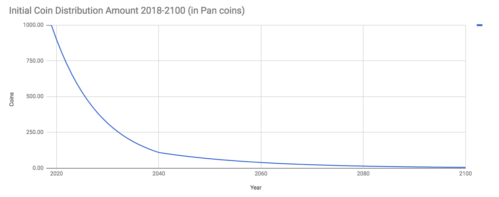
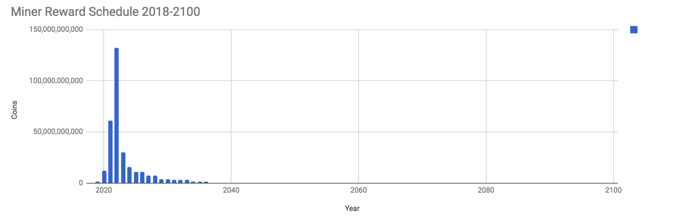
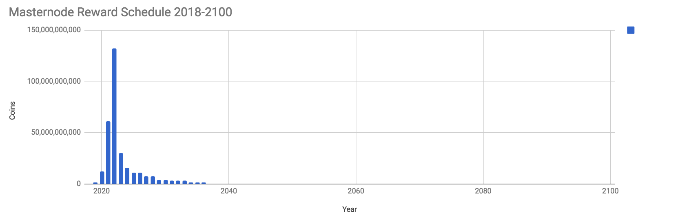
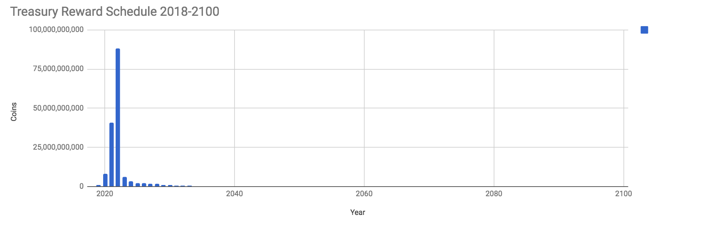
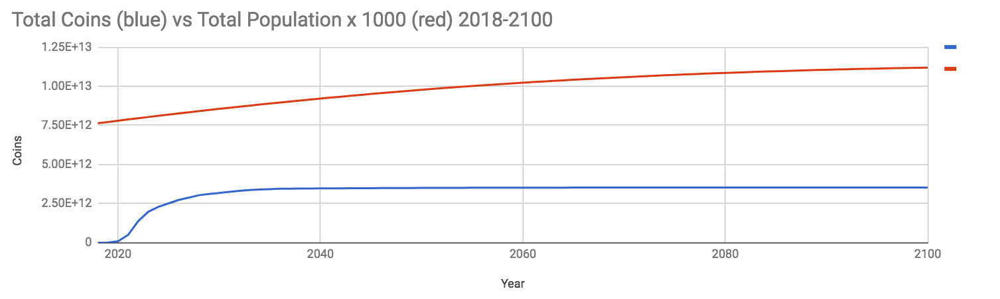

# Crypto for All Humanity: The PAN Manifesto

# Table of Contents
- Crypto for All Humanity: The PAN Manifesto
	- Executive Summary
	- Elevator Pitch
- Manifesto
	- Introduction
	- We Believe...
		- Ledgers are the Building Blocks
		- It Starts with the Individual
		- Poverty is Unacceptable
		- Questions are Powerful
		- The Global Poor are not so Poor
		- Middlemen are Obsolete
		- Blockchains Work
		- Some Blockchain-Based Systems are Better than Others
		- The Crypto Economy Must Grow
		- The Best Goals are Absurd
		- Generally Speaking
	- We Intend...
	- Why Pan Matters
		- The World Needs Pan to…
		- The Cryptocurrency Ecosystem Needs Pan to…
		- What Makes Pan Different
		- Pan vs. Other Anti-Poverty Projects
			- Basic Income
			- Microcredit
			- Charity and Foreign Aid
			- M-Pesa
			- Direct Cash Transfers
		- Pan vs Other Crypto Anti-Poverty Projects
			- Humaniq
			- Others
		- Pan vs Other Crypto Property Registry Projects
	- Call to Action
- Execution Plan
	- Summary
	- Economics
		- Initial Coin Distribution (ICD)
		- Block Rewards
		- Block Rewards Distribution Table
		- Coin Emission Rate
	- Product
		- Identity and Reputation
		- Initial Coin Distribution
		- Digital Cash
		- Business Skills & Mindset Education
		- Social Network
		- Property Registry
	- Network Effects
	- Marketing Strategy
		- Target Audience
		- Build User Attachment
		- Use Cases
		- Merchant Adoption
	- Technology
		- Protection from Sybil Attacks
	- The Pan Organization
		- Form
		- Principles
		- Values
		- Vision
		- Team
			- Advisors
	- Roadmap
		- Market Research
		- Initial Testing
	- Key Considerations
		- Key Challenges
		- Key Risks
		- Key Advantages
		- Why a New Cryptocurrency is Required
	- Execution Plan Conclusion
	- What's Next
		- Participate
- Notes
	- Relevant Quotes
	- Metadata
	- Translations
	- Contact
	- References

## Executive Summary

The Pan project aims to add 1 billion new users to the cryptocurrency ecosystem within 5 years, double developing world GDP within 10 years, spark an economic growth miracle among the 5 billion members of the global poor and increase the resiliency of the cryptocurrency ecosystem so that the coming global cryptocurrency regulation scheme is more like the Japanese model and less like the BitLicense.

The global mass population has lost trust in their national institutions — governments, corporations, media and non-profit organizations — in 20 of 28 countries surveyed in the 2017 Edelman Trust Barometer, and trust levels are declining in 21 of 28 countries. The World Bank says that its poverty reduction goals can not be met with current levels of economic growth. The cryptocurrency community faces the spectre of a global cryptocurrency regulation scheme. The time is right to grab the initiative, get billions of the global poor — entrepreneurs and hard workers of the informal economy who have been excluded from the globalizing world economy — into the cryptocurrency ecosystem. Crypto must grow, and the informal economy is the largest, yet most fragmented, marketplace in the world. As such, they represent a unique opportunity at a unique moment where new solutions are being sought.

Pan is many things but first and foremost a prosperity network, with a staged, incentivized and gamified airdrop of a new cryptocurrency (easy-to-use digital cash) and a reputation and social media network that incentivizes Pan participants to connect with and leverage the greater cryptocurrency ecosystem for economic growth.

80% of humanity lives on less than $10 per day. 1.8 billion use drinking water that puts them at risk of polio, cholera, typhoid and dysentery. 5 million people, mostly children, die each year from water-borne diseases. 800 million people, 300 million of which are children, do not have enough food to eat. 90% of these 300 million children are enduring long-term malnourishment. “The poor are hungry and their hunger traps them in poverty,” as The World Food Programme has argued. Global poverty is simply unacceptable. 

But the 5 billion global poor are not defenseless. They are mostly just undocumented. Legacy middlemen, such as banks and governments, have excluded the poor from the global marketplace. The assets of the global poor are actually many times greater in value than those of the globalizing first world. But these assets are registered on fragmented and disconnected informal ledgers that preclude them from being leveraged to finance development. 

Legacy middlemen can not be trusted to take a leading role in the blockchain evolution or the elimination of global poverty and informality. We the people, ourselves, must take the lead. Legacy middlemen may follow, but they have squandered their opportunity for leadership and only proven that they wish to exclude the poor from globalization.

We envision a world where the global informal, or extralegal, economy, with its 5 billion participants, becomes the global blockchain economy and lets loose a torrent of economic growth that will materially resolve persistent problems like poverty, malnutrition, early death, sex trafficking, slavery and more.

We envision a world in which every human being has an immediate financial stake in the economic system, and can immediately have in a liquid form their human capability and economic potential — their capital — so that they can add to the global culture.

We envision a world with 1 billion new Pan cryptocurrency users within 5 years of the launch of Pan, where these users actively participate in a wide range of cryptocurrency projects, where cryptocurrency adoption is no longer a subject for concern but a reality, where we are experiencing a doubling of developing world GDP within 10 years of the launch of Pan, and have effectively eradicated poverty within 25 years.

We envision a world in which the crypto economy is solving all the problems governments and other middlemen have not solved, and where the cryptocurrency ecosystem enjoys unprecedented respect and influence on the global stage as a result.

Pan is not charity. Pan is not “hope for the poor.” Pan is an opportunity to connect the crypto economy with the informal economy, and have both profit. Pan is an unbreakable network for telling a new story about prosperity in the 21st century.

[Join us](http://pan.money/join/) as a core team member, co-founder, advisor, ambassador or ally, and play a leading role in eliminating global poverty, sparking an economic growth miracle, onboarding the next billion cryptocurrency users and shielding the cryptocurrency ecosystem against the coming global crypto regulation scheme.

## Elevator Pitch

A merchant-first, mobile-centric universal trustless digital cash system in which every human being enjoys a roughly equal starting stake, targeted at the 5-billion-strong global poor, featuring a staged, gamified and incentivized initial capital airdrop with a biometrics-based identity and web-of-trust-style verification process, an accompanying self-serve educational program and an aggressive, hands-on, localized and viral marketing strategy in the developing world, in order to stimulate a doubling of GDP across the developing world within 10 years of its launch, bring 1 billion new participants into the greater cryptocurrency ecosystem (thus serving as a gateway coin), solve the cryptocurrency adoption challenge and improve the power position of the crypto economy vis-a-vis the growing call for unified global cryptocurrency regulation.

# Manifesto

## Introduction

The 5-billion-member global poor, sometimes wholly or partly known as the global informal economy, with their existing but fragmented ledger systems and their exclusion from the globalizing financial world, represent not just the largest marketplace in the world but also the most fertile customer base for cryptocurrencies.
Without credit cards or bank accounts, the global poor can not buy bitcoin at an exchange. They may not know anyone who deals in cryptocurrencies, and, because their surprisingly considerable assets are locked up as dead capital in fragmented legacy ledger systems, many are not liquid enough to invest in existing cryptocurrencies. Even when one individual can get bitcoin, or another cryptocurrency, it is likely that no one else in their existing economic network has any, and thus the cryptocurrency can serve only a highly limited role as a store of value — a role that leaves most of the value of cryptocurrencies on the table.
Pan issues an initial coin distribution (ICD) to every member of humanity in order to solve this problem. Through a multi-layered verification process, we will bootstrap a new opaque blockchain-based cryptocurrency and apportion a roughly equal value of coins to each member of humanity alive after the creation of the genesis block.
Pan aims to incentivize 1 billion human beings to open Pan accounts within 5 years of launch in order to spark a Third World Miracle, like the one in East Asia in the latter half of the twentieth century. We aim to double the economic growth rate of the developing world within 10 years. We aim to effectively eradicate poverty within 25 years.
We are creating a new, globalized trustless digital cash and ledger system that is not compromised by rent-seeking middlemen like governments and banks. Within the Pan system, where participants can hold clear title to their property, we will have the basis of a competing globalizing world order with the individual human being at its center, protected from the predatory behavior of legacy middlemen.
Join us.

## We Believe...

Global poverty is unacceptable. 80% of humanity lives on less than $10 per day. 1.8 billion use drinking water that puts them at risk of polio, cholera, typhoid and dysentery. 5 million people, mostly children, die each year from water-borne diseases. 800 million people, 300 million of which are children, do not have enough food to eat. 90% of these 300 million children are enduring long-term malnourishment. “The poor are hungry and their hunger traps them in poverty,” as The World Food Programme has argued.

But the 5 billion global poor are not defenseless. They are mostly just undocumented. Legacy middlemen, such as banks and governments, have excluded the poor from the global marketplace. The assets of the global poor are actually many times greater in value than those of the globalized first world. But these assets are registered on fragmented and disconnected informal ledgers that preclude them from being leveraged to finance development. 

Trust in institutions is declining across the globe. Inflation renders fiat currency useless for savings and capital formation across the developing world. Government property ledgers are untrustworthy and subject to corruption. Nation-states are not interested in including the mass population in “official,” globalizing markets. Non-profit and foreign aid charity only sets the poor up for greater dependency. Microcredit creates new burdens for the poor and fails to support anything more than the least efficient small-scale businesses. Global poverty will likely continue to improve marginally, but widespread, substantive change in the poor’s quality of life remains a utopian vision.

The answer to global poverty is blockchain technology. The answer is a gamified airdrop of a new cryptocurrency to the global poor to make their existing capital liquid and fungible. The answer is a blockchain property registry for the entire globe that unifies the existing, fragmented ledgers of the global poor so their property can be made fungible, and therefore leveraged for development as capital. The answer is blockchain capitalism.

The crypto world is too small, at perhaps only 1-2% of the global population aged 15 and above, and may not reach 200 million users before 2024 without a Marshall-Plan-style big-picture growth strategy using methods heretofore untried or unknown. The crypto world is too centralized, with the top 4 Bitcoin mining groups controlling 53% of capacity, and the top 3 miners controlling 61% of Ethereum’s mining capacity. The crypto world is vulnerable to BitLicense-style global regulation schemes. Crypto must grow — or risk containment and stagnation.

The global poor are the market that will have the most uses for cryptocurrency, given that, unlike in the developed world, their current ledgers are fragmented, their fiat currency savings are inflated away and their nation-states reduce their ability to realize economic growth with regulations, fees and taxes. The global poor can also be our strongest allies because they are already outside the current government-banking system. By distributing existing cryptocurrencies based on existing wealth and connectivity, we have locked the global poor out of cryptocurrencies — so far.

We can effectively eradicate global poverty within 25 years by sparking an economic miracle in the developing world using blockchain-based digital cash and property registry systems to provide the foundational elements of freed markets.

We can bring 1 billion new people into the cryptocurrency ecosystem within the next 5 years and, by doing so, strengthen all worthy crypto projects as well as our negotiating position vis-a-vis the coming global cryptocurrency regulation scheme. We can solve the cryptocurrency adoption challenge, open new engines of growth — despite China’s crypto crackdowns — and solve buy-in for people without credit cards and bank accounts.

We can 100x the adoption of cryptocurrencies within 10 years. We dare not wait any longer. Cryptocurrency that does not serve the mass population of Earth is a technological toy, nothing more.

### Ledgers are the Building Blocks 

 -   The ledger is the center and foundation of civilization and economy, because it tells us who is accountable for what, a deceptively simple function that enables the creation of capital.
-   Most of the ledgers in use today in government and business are inefficient, expensive, opaque and by design susceptible to fraud and corruption. Today’s ledgers require trust in middlemen, such as governments and financial institutions, in order to operate properly. As such, there is a moral hazard inherent in today’s ledger systems, because, when individuals open bank accounts and register businesses, governments and financial middlemen stand to gain in the form of greater power and individuals stand to lose from taxes, fees, expropriation and inflation. 
-   Twenty-first century nation-states have corrupted many of society’s ledgers, used the existing ledgers to increase their wealth without actually creating new value (rent-seeking) to the benefit of the elite and the detriment of the mass population, and have excluded as much as 80% of humanity from the use of ledgers that are integrated into the global financial system, a situation that causes informality, poverty, lack of capital formation and exclusion from the globalizing world order, to the detriment of all humankind.
-   All of humankind’s achievements come from connecting people and things, and capitalism enables us to find the best economic combinations of people and things, as economist Hernando de Soto has said.

We believe that the ledger is the foundation of economic progress but that today’s ledgers are corrupt, vulnerable and/or disconnected. Bitcoin represents the separation of state and ledger, and its time is here.

### It Starts with the Individual

-   Every individual is the end goal of his own life, and has as his birthright the legal and moral right to live it in freedom, as he sees fit, without being subject to aggression or fraud, or engaging in aggression or fraud.
-   Every individual has the right to control his legitimately-obtained property.
-   When every individual has the opportunity to realize his innate human potential, all humankind benefits. Each additional individual who has the opportunity to realize his potential in a way of his own choosing and is added to a network of similar individuals, adds value to that network in ways that are both seen and unseen.
-   Every human being should have direct access to the global economy, to interact with it in his own way, consensually with other participants, without the involuntary intermediation of middlemen, and to shape his own societies as he deems appropriate, without using aggression or fraud, in consensual collaboration with others. He should not be forced to fit into anyone else’s paradigm but should be allowed to grow into his own paradigm.
-   People shouldn’t have to emigrate to find a better life, they should be able to build it where they are with the tools they have now.
-   Society starts with the individual. Governments, corporations and other rent-seeking middlemen come last. Successful economic systems originate with the individual through his consensual interactions with other individuals, and governments must accept them. Never the other way around.
-   Our lives are determined by the stories we tell ourselves.
-   Too many people tell themselves stories of scarcity. We can offer them stories of post-scarcity and abundance. We can build tools to validate stories of upward mobility. We can incentivize, mentor and support entrepreneurship that results in tangible economic growth.

We believe that the individual is the beginning and the end of all economic growth, and has liberty as his inviolable birthright.

### Poverty is Unacceptable

 -   “Poverty is the scarcity or the lack of a certain (variant) amount of material possessions or money,” as Wikipedia states.
 -   80% of humanity lives on less than $10 per day.
 -   80% of humanity spends its life in a precarious and ultimately wasteful search for its next meal due to lack of capital, thereby losing uncountable potential contributions of talent and genius to the global culture and economy.
 -   3 billion people live on less than $2.50 per day. Almost half of them live in extreme poverty on less than $1.25 per day.
-   25% of humanity lives without electricity.
-   40% of humanity does not have basic sanitation.
-   1.8 billion people use drinking water that is contaminated with faeces, which puts them at risk of  polio, cholera, typhoid, and dysentery.
-   800,000 people die every year due to diarrhea that results from inadequate drinking water, sanitation, and hand hygiene.
 -   5 million people, mostly children, die each year from water-borne diseases.
-   800 million people, 300 million of which are children, do not have enough food to eat.
-   90% of these 300 million children are enduring long-term malnourishment.
-   “The poor are hungry and their hunger traps them in poverty,” as The World Food Programme has argued.
 -   More people die every year from hunger than from HIV/AIDS, malaria, and tuberculosis combined.
 -   Every 3.6 seconds, a person dies of starvation, most of them children under 5.
 -   1 billion children are in poverty across the globe and 22,000 of them die every day because of poverty, and, according to UNICEF, they “die quietly in some of the poorest villages on earth, far removed from the scrutiny and the conscience of the world. Being meek and weak in life makes these dying multitudes even more invisible in death.”
-   150 million children under 5 have seen their growth stunted due to chronic malnutrition, accounting for approximately 27% of all children in the developing world, and mostly in South Asia and sub-Saharan Africa.
-   2 million children die every year of preventable diseases such as diarrhea and pneumonia because they can not afford proper treatment.
-   72 million children of primary school age in the developing world are not going to school, 57 per cent of whom are girls.
-   According to the World Bank, the most extreme level of poverty has decreased over the last 30 years but reaching their goal of reducing extreme poverty to just 3% of the world population by 2030 is not possible with the current rate of economic growth.
 -   Population growth in Africa is such that the continent of Africa will hold 40% of humanity by 2100. Africa is the future and the number of human lives that will be created there in the next 80 years demands that good people work together to ensure they are healthy and prosperous lives that add to the greater future of humanity.
 -   4 billion people are locked out of the global capitalist system.
 -   People understandably get violent when they feel they are excluded, though violence is only acceptable when used in self-defense.
 -   Poverty leads to social unrest and social divides because of income inequality.
-   Ills associated with poverty include substance abuse, debilitating accidents due to unsafe working conditions, hazards such as lead and pesticide poisoning, substandard living conditions, disease, child labor, child soldiers, war, substandard infrastructure, unemployment, domestic violence, shortened life expectancy, stunted growth, terrorism and more.
-   The global poor can’t effectively save the excess income they produce because either no bank will serve them or banks charge fees that eat through their meager savings, and because inflation eats the value of their savings.
-   The value of the wages of the global poor decline in real terms due to the inflation of fiat currency by nation-states but wealth perpetuates itself indefinitely, so the poor can not catch up just by working harder.
-   Poverty affects women and children disproportionately.
-   Poverty can become a self-sustaining cycle that becomes difficult to break.
-   People are escaping poverty worldwide but their progress is precarious and too slow.

We believe that the global poverty situation is entirely unacceptable, that it presents a grave threat to the future economic, intellectual and cultural development of humanity, that it presents the greatest challenge to be solved by the greatest minds of the 21st century — and that we can effectively eradicate it within 25 years through the innovative use of cryptocurrency.

### Questions are Powerful

-   We know what projects to make rich people richer look like. What about a project to make poor people a little bit wealthier? A lot wealthier? What does that look like?
-   What if immigration from the third world to the first world is just an attempt to gain access to capital and a ledger system that is relatively less corrupted and fragmented?
-   What if the successful basic income experiments in the developing world are not testing the effectiveness of a basic income but the utility of receiving an infusion of liquid capital?
-   How can we 100x the adoption of cryptocurrencies in 10 years? 
-   How can we bring 1 billion new people into cryptocurrencies in the next 5 years?
-   How can we ensure that global regulation of cryptocurrencies is favorable to the crypto economy?
-   How can we balance the monopoly power of the nation-state in the near term?

We believe that asking the right questions is more powerful than proposing the right answers. These are some questions that have guided the development of the Pan manifesto.

### The Global Poor are not so Poor

-   The global poor are not so much poor as undocumented, not so much unemployed as undercapitalized, and not so much undercapitalized as their capital is illiquid (not fungible). Their economy is not so much informal as extralegal.
-   The root of poverty is the lack of liquid capital with which to invest in economically productive ends, of which there are many accessible to the global poor.
-   The global poor are more aptly named the global undocumented as they lack “the documents required to live, work and make contracts in a particular place,” as economist Hernando de Soto has said. This results in a state of defenselessness against expropriation and environmental contamination by powerful entities, as well as great difficulty in accessing credit and capital.
-   The global poor are the backbone of the global informal economy, an economy that operates outside of nation-state-approved markets because its members are excluded from participation in the legal economy due to lack of government registration documents, due to a desire to avoid taxation and expropriation, and for other valid reasons.
-   The global informal, or extralegal, economy is the largest, but most fragmented, marketplace in the world, with as many as 5 billion members.
-   More than half of total employment (much if not most of it self-employment) in developing countries is in the informal economy, and as much as 90 percent in South Asia and Africa.
-   The informal economy is more than 1/3 of the developing world’s GDP. 27% of non-agricultural output in North Africa comes from the informal economy. That number is 29% in Latin America and 31% in Sub-Saharan Africa and Asia.
-   70% of the economies in Thailand and Nigeria are the informal economy.
-   65% of homes in the Philippines are unregistered, a number that is above 80% in many other developing countries.
-   60% of families in Latin America have not formally registered their property, and many have given up attempting to do so due to the time, cost and complexity of the registration processes.
-   70% of land plots in Latin America are undocumented.
-   The poor in Peru own assets valued at more than 11 times the value of the equities on the Lima Stock Exchange.
-   The global poor own the majority of the world’s assets but they lack the financial system to leverage it  as capital for development.
-   The poor are able to create wealth. The problem is that it is fragmented among many different extralegal systems and ledgers, and thus can not be made into fungible capital suitable for the financing of further economic development. Blockchain technology can solve this problem and, in so doing, unleash the economic power of the informal economy.
-   The global poor are more entrepreneurial than the global elite.
-   The global poor do not require a basic income, foreign aid or charity. They will most benefit from a capital airdrop to make liquid their existing human capital along with a universal, stateless distributed ledger system through which they can enjoy international identity, reputation, value transfer, value storage, asset registry, contract recording, credit, the issuance of shares in their enterprises, governance and more. This will connect the global poor in a global ledger and marketplace without artificial limits or corruption that is larger than the first-world globalizing economy.
-   The global poor are going to find a way for their fragmented ledgers to interoperate. When they do, they will unleash an unstoppable wave of economic growth. Helping the global poor achieve the equity they require to experience rapid economic growth is going to be both fun and profitable for every human being.
-   The global migration from rural to urban areas is a migration in search of capitalism. These people are in transition, are prime candidates for cryptocurrency adoption and can be ambassadors for crypto in the urban milieu.
-   The global poor are told they must globalize; that is to say join an economic system dominated by the global elite. But they need only blockchainize in order to realize the benefits of capitalism and outstrip the wealth created by the global elite over the last two centuries.
-   The best way to escape poverty is via medium- and large-scale entrepreneurialism. The global poor are already engaged in this in a huge way. They simply need middleman-free, trustless ledgers that enable them to be included in the global economy, so they can build larger enterprises, access credit and deal with the developed world on more equitable terms.

We believe that the global poor are lacking mostly in liquid capital, and that when their surprisingly significant existing capital is made liquid and fungible, that it will catalyze a wave of economic growth across the developing world that will enrich all humanity and effectively eradicate global poverty within 25 years.

### Middlemen are Obsolete

-   Rent-seeking middlemen, such as governments, banks, insurance companies, centralized social networks, internet service providers, marketplace operators, lawyers, accountants and courts, are an unnecessary vestige of 20th-century state capitalism and, in fact, are the prime impediment to the continued economic growth of all humankind because they interfere with direct person-to-person economic relationships, reduce efficiency and increase costs without adding comparative value.
-   Government bureaucracy is holding back the economic development of the global poor by making them jump through overly-demanding and expensive hoops in order to register their property and businesses, and thereby benefit from a ledger system in order to improve that property via credit.
-   Financial middlemen in the developing world maintain their power by denying credit, and thereby controlling who may enter any given market. Together with bureaucrats and their infamous red tape, these two groups are effective at keeping the global poor in poverty.
-   Freed markets generate economic growth but closed and protected markets fail to grow.
-   Many governments in the developing world have enacted barriers to free trade that stifle economic growth for their citizens, leaving them trapped in islands of illiquid and difficult-to-trade capital.
-   Governments, through their mismanagement of fiat currency systems and property ledgers, have caused economic bubbles and excessive indebtedness across all levels of society, a situation that leads to great economic precariousness for the most vulnerable among us.
-   75% of the global poor do not have a bank account. This represents a failure of legacy middlemen.
-   Businesses in the developing world must pay administrative costs three times higher than those faced by businesses in the developed world. This is a direct result of legacy middlemen and their corruption.
-   To register a business, it takes 89 days in India but 8 days in Sinagpore. To register a property in the Philippines, it takes 33 days, but only 8 in the US.
-   The global mass population has lost trust in their national institutions — such as governments, corporations, media and non-profit organizations — in 20 of 28 countries surveyed in the 2017 Edelman Trust Barometer, and trust levels are declining in 21 of 28 countries.
-   The idea of a trusted central authority is broken because modern society is simply too complex to be managed centrally. Society must be polycentric.
-   Middlemen must be cut from the economic landscape through the practice of individuals doing business directly with each other. We can and should end middlemen.
-   The Age of the Organization is dead, as Taylor Pearson argues. We are now entering a Blockchain Era, where the savvy individual is able to coordinate the services not just of an organization but of the globe. With direct access to the global economy, savvy entrepreneurs can now form economically-efficient enterprises with a minimum of resources.
-   The issuance of money is best based on a mathematical formula that is a factor of the growth of humanity, and not based on the arbitrary whims of governments, central banks or credit banks, and that is not based on debt, and is not therefore a trap for the least liquid when credit contractions are effected.
-   We need a monetary system that is built to serve the individual human being, rather than to make a profit at his expense. 
-   Corruption slows economic growth and diverts it in a direction that doesn’t serve individuals in the most efficient manner. It can lead to unsafe infrastructure and capital flight. Corruption of any shape or size keeps people poor. It gives inefficient and dishonest companies an advantage over the efficient and honest. We must grow beyond the ability for legacy middlemen to corrupt, so that we are progressively more immune to their corruption over time.
-   Many governments across the world are oligarchical — they are controlled by a few dozen or hundred families for their own benefit, and to the detriment of the mass population. 
-   The power of governments to print new money when it suits the elite’s agenda is a power that must not be underestimated. It is the power to bribe and bully, writ universal. No one, not even other governments, is safe from this unchecked power. It is a power that must be balanced, if not entirely eliminated. 
-   The power of governments to regulate, that is to limit liberty and to rent-seek, enables them to choose winners and losers in the marketplace, to elevate inefficient but politically-connected firms over more efficient ones and to bully enterprises to do their bidding.

We believe it is time to start fresh with a new trustless distributed-ledger-based currency and property registry system that recognizes the individual human being as the center of the system and the source of all value and legitimacy, that includes everyone, roughly equally, and that gets rent-seeking middlemen out of the picture so individuals can trade directly across and within nation-state borders, without artificial limits that benefit those with legacy nation-state power.

### Blockchains Work

-   The blockchain, or distributed ledger technology, as pioneered by Bitcoin creator Satoshi Nakamoto, is a viable upgrade for the world’s ledgers because it minimizes the need for trusted third-party middlemen, makes it easier to solve disputes, can reduce risk and fraud and hold all of a system’s participants to a very high degree of accountability.
-   The blockchain can be used not just as a digital cash system by every human being, but also as a trustworthy property ledger to replace the untrustworthy property ledgers of the nation-states and the fragmented ledgers of the informal economy.
-   Today’s existing middlemen can not be trusted to implement the ledgers of tomorrow, whether they use distributed ledger technology or not. They have proven themselves untrustworthy. We must design a new, trust-minimized distributed ledger ecosystem that routes around today’s middlemen as if they were damaged nodes in an economic network.
-   The blockchain is immutable and therefore resistant to the self-serving tampering that led to such debacles as the Lost Decade in Japan, the 2007-2008 financial crisis in the United States, ponzi schemes and other examples of middleman corruption.
-   The blockchain is a tool that is apt for storing and preserving the truth of any given economic situation because it is tamper-evident and largely incorruptible, and is compatible with Mohandas K. Gandhi’s satyagraha, otherwise known as truth force, a viable nonviolent alternative to the use of violence in human affairs.
-   Blockchainism is a political philosophy that stands in contrast to capitalism and socialism and is characterized by the use of decentralized trustless mechanisms for managing the economic relations of individuals, the ruthless elimination of middlemen, the enshrinement of the individual as the center of the economic universe, a disregard for the artificial and constricting borders of nation-states, and the favoring of nonviolent truth force over aggression in order to resolve disputes. Blockchainism is anti-tribal, pro-individual, pro-diversity and anti-conformity. Blockchainism finds value in everything and seeks to make it liquid via tokenization — the process of creating a digital counterpart for all assets that can be controlled directly by the owner — in order to improve its value further and offer as many people as possible a stake in it. Blockchainism chooses agency over obedience, markets over central planning, respect over disdain, proactive empathy over apathetic indifference, optimism over pessimism, self-determination over social contract and exit over voice.
-   Using blockchains, we can formalize the fragmented ledgers of the 5-billion-person-strong informal economy and connect them in a new, corruption-resistant global economic system that is under distributed individual control, with transparent and equitable rules, and is free of rent-seeking middlemen, in order to foster equitable economic growth for all and reduce economic inequality using freed markets.

We believe that the blockchain is a viable tool to unify the fragmented ledgers of the global informal economy into a new, global freed marketplace where all can enjoy prosperity.

### Some Blockchain-Based Systems are Better than Others

-   The most successful cryptocurrency is the one that is understood, held and used by the greatest number of people, with the highest rate of merchant adoption, for the broadest number of uses with the highest velocity of money and the lowest transaction fees.
-   The most adopted blockchain will be the one that is designed to meet the needs of the largest target market. A successful blockchain system is designed in consultation with its customers, not alone or only in consultation with other blockchain experts.
-   The most widely adopted blockchain digital cash system leads with merchant adoption.
-   The most successful blockchain digital cash system takes extra steps to protect its users from theft and loss of private keys.
-   The best blockchain digital cash system enables participants to protect their capital from rent-seeking middlemen.
-   The most successful blockchain digital cash system is preceded and accompanied by a self-serve educational program to instruct new cryptocurrency adopters on how blockchains work, security in a blockchain world, the basics of business, growth mindset and more, as well as multiple methods for participants to connect with each other directly and independently.
-   The best blockchain system intended for mass adoption starts from the bottom up, partnering with individuals, discovering and meeting their needs. It does not start from the top down, seeking first to accommodate itself to government dictates in order to gain the permission of legacy middlemen. Legacy middlemen are the reason why the global informal economy exists. We will not achieve global ledger interoperability by seeking the permission of those who profit from keeping us separate and controlled.
-   Blockchain technology needs to scale. The cryptocurrency ecosystem will benefit from a project that is focused on bringing in large numbers of new participants because such a project will create strong demand and urgency for scaling solutions.
-   The best way to scale blockchain technology is to build demand first. Make the people come, and the developers will build it.
-   The rules say you have to buy into a cryptocurrency. It’s time to break that rule.

We believe that the most successful blockchain will be the one with the most participants who use it the most and understand it the best.

### The Crypto Economy Must Grow

-   The crypto world is too small. The number of cryptocurrency users is estimated by some sources at between 3 million and 50 million, and may not reach 200 million users before 2024. Even if we are 50 million, that is only 1% of all human beings between the ages of 15 and 64.
-   The crypto world is too centralized, not due to any conspiracy or acts of bad faith but just due to the small size of our community. The top 4 Bitcoin mining groups control 53% of the average mining capacity. Three miners control 61% of Ethereum’s mining capacity.
-   Adoption is far from solved, with unattractive wallet user interfaces, confusion among new users and other inconveniences.
-   Buy-in is a financial and technical challenge for everyone but the global elite. The global poor have no credit cards or bank accounts, generally speaking. When they can get some cryptocurrency, they find that few or none of their real-world trading partners have crypto, and the most they can do with their cryptocurrency is hold it indefinitely, thereby leaving most of the value of cryptocurrencies unrealized.
-   The global poor are the group who will have the most uses for cryptocurrency, given that their current ledgers are fragmented, their fiat currency savings are inflated away and their nation-states reduce their ability to realize economic growth.
-   By distributing new cryptocurrencies based on existing wealth, we have locked the global poor — those who stand most to benefit and those who can be our best collaborators because they are outside the current government-banking system — out of cryptocurrencies.
-   Cryptocurrency that does not serve the mass population of Earth is a technological toy, nothing more.
-   Global regulation of cryptocurrencies may ultimately be helpful to cryptocurrency users, investors and creators. But it is also a threat to the continued growth of crypto, and a race for power. Governments are tentatively organizing a coalition for global regulation of cryptocurrencies — a united front for whatever regulation scheme they settle on, be it the Japanese model, the BitLicense or something in between. We must do the same — by building our userbase, by growing and by demonstrating how crypto is solving problems that governments can’t. We must build power in the real world, because, in the final analysis, that is the only thing that governments respect. We can arrive at the negotiating table holding the balance of power in order to ensure that global regulation is helpful, and not crippling.

We believe that there is a great deal of urgency to bring new people into the crypto world in order to improve decentralization, adoption and the general utility of cryptocurrency systems. In fact, crypto’s freedom to continue growing is at stake.

### The Best Goals are Absurd

Nobody ever achieved anything with modest goals. We need to grow and we need to do it now. 10x thinking is where the Pan project is at. Some of our goals include:

-   10 million people hearing about Pan in the next 10 days.
-   1,000 people working on the Pan vision within 10 weeks.
-   A core team of 7 people that makes top-10-crypto CEOs jealous.
-   A 100,000-person network working on Pan within 10 months.
-   1 billion new cryptocurrency users within 5 years.
-   2x developing world GDP within 10 years
-   Effectively eradicate global poverty within 25 years.
-   A new human capital birthright — forever.

We believe adoption can happen a lot faster than many think but only if we think big, think selflessly, design smart systems and take big risks.

### Generally Speaking

-   Incentives are more powerful and useful than violence.
-   It is better to build power than to curry favor with the powerful.
-   Simplicity is best.
-   Economics is not a zero-sum game. Together, we can all grow.
-   Honesty, integrity and transparency are the building blocks of a prosperous world.
-   Cryptocurrency tends to bring prosperity to its adopters over the medium to long term.
-   If we don’t bring the global poor into the crypto space, we will be the losers.
-   A payment system that includes everyone benefits everyone.
-   All humanity would benefit if every human being at the age of majority received a birthright capital airdrop.
-   Cooperation is addictive, and we can build a self-perpetuating, pay-it-forward chain of cooperation that benefits everyone.

We believe that good people must step forward and create new trustless money and ledger systems to realize a vision of humanity that includes everyone in a borderless, freed global marketplace where poverty is a thing of the past.

## We Intend...

We live in a world of technological marvel and economic growth, where our basic human needs are taken care of so that we can realize our inherent and individual intellectual, artistic and social potential as human beings. But that vision is reality for only twenty percent of humanity.

Eighty percent of the human population lives on less than $10 per day. About half of the global poor live on $2.50 per day and a little less than half of them live in extreme poverty, on just $1.25 per day. These people are starved for capital, their lives spent in a constant, precarious and primitive search for their next meal. As a result, the global poor do not receive adequate education, nutrition, clean water or healthcare. As many as 22,000 children die every day because of poverty.

The global poor represent both a threat to the vision of global economic growth — because it’s not working for them — and its greatest potential engine. Humanity can not continue with only some of its number having access to prosperity. Either we must all have access to the promise of prosperity, or prosperity itself will stumble, falter and transmute into stagnation and despair.

Wealth perpetuates itself through interest and return on investment, growing ever greater over time. But the poor trade their bodies and time for inflationary government-manipulated fiat currency that declines in value over time. Any surplus wealth they create can not effectively be saved in fiat currency because governments are constantly inflating it away, some more than others.

Basic income experiments have shown that, when given extra capital, the global poor will use it to improve their lives, through investment and spending on necessities such as food and education.

We believe that every human being can realize their innate potential. We believe that every human being can be not just a self-sustaining economic unit, but also one that adds value to every other human economic unit on the planet through the institution of the free market, without a central authority to manipulate it.

We believe that what is lacking to realize this vision is capital, and not the expensive and dependency-forming government welfare that is the universal basic income.

We believe that the current world is one where governments too frequently pick winners and losers, where government, a rent-seeking middleman itself, effectively cultivates other rent-seeking middlemen to prey on the poor and prosper to the disadvantage of the poor, especially in the areas of government, banking, insurance, dispute resolution, property registration and currency.

We will create a blockchain-based global ledger system to replace the corrupted government-middleman order and stimulate the fragmented informal economy.

We will stake every human being over the age of majority into this system with a staged and incentivized initial coin distribution (ICD). Every human being will have an incentive to become a part of the network and to start transacting in it. Every human being immediately is included in the Pan system: existence is your buy-in. Prior to the receipt of the airdrop, participants will have to complete a self-serve, video-based, mobile-first educational program in order to ensure they are prepared to use their new capital safely.

Humans will be able to exchange coins instantaneously and for reasonable fees using only a cellphone. There will be incentives for merchant adoption. The Pan app bootstraps a prosperity network where individuals can show off the progress towards their goals that Pan has facilitated.

We will expand the Pan vision by working with experts on poverty, economics, cryptocurrency, politics, economic development and more.

We will secure funding in a method to be determined and onboard tech, marketing and support teams. We will take the best tech currently available in the cryptocurrency space and marry it to a savvy marketing program in order to gain massive adoption: 1 billion verified humans within 5 years.

We will perform initial testing of a proof of concept in the Latin American Spanish-speaking developing world, likely Mexico, Argentina or Colombia, simultaneously with the Philippines (in English). With proper funding, we can add a third testing region, the 540 million Hindi speakers of Northern India.

Once we are near to having a working initial system, we will recruit and incentivize a network of community organizers using digital marketing who will catalyze the use of the currency in their local communities, simultaneously across the globe in a massively parallel process with the help of translators and community leaders. The process will ideally decentralize and take shape under the direction of the community leaders with the founding team just providing support.

We may add a smart contract layer to the blockchain with the intention of enabling humans to register assets so as to make them liquid (for mortgages) and tradeable. Our goal is to enable the poor to cut out rent-seeking middlemen from their lives, so they can have services like banking, insurance, dispute resolution, contract validation, social networking, currency exchange, governance, financial instruments, wills, medical records, and more without having to rely on rent-seeking middlemen. However, we would prefer to instead connect Pan participants with other worthy cryptocurrency projects that can provide these services, and thus have Pan serve as a gateway coin to the crytocurrency ecosystem.

We will spark a global economic miracle like that of post-WWII Japan, Taiwan, South Korea or Singapore. We will become the tip of the adoption spear for the cryptocurrency ecosystem, bringing it to the largest marketplace ever: the global informal economy. We will educate and train cryptocurrency users and evangelists that can also increase the adoption rate of other worthy cryptocurrency projects.

We are starting a conversation around this topic with the intention of seeking the people and resources needed to make the Pan project happen.

Much work remains to be done to clarify and implement the Pan vision. If you like our principles, plan and/or vision, then join us. Together, we will create a borderless, trustless global digital cash system for all humanity. Together, we will effectively eradicate poverty and bring equitable power to those who are today excluded from the global financial system.

Pan is the unbreakable prosperity network for the 21st century, providing the tools for human cultural and economic growth across borders and without artificial limits.

## Why Pan Matters

Pan is crypto for all. It’s a new human birthright that aims to solve global poverty not through dependence-forming charity or burdensome credit but by bringing opportunities for growth, tools, training and psychological support to developing world entrepreneurs. With a viral transmission component, merchant incentives and as much as 80% of the Pan coin supply reserved for airdrops, Pan aims to solve the cryptocurrency adoption challenge and definitively alter the balance of power between governments and the crypto economy — in our favor.

Pan aims to:
- End global poverty within 25 years.
- Add 1 billion new cryptocurrency users within 5 years.
- Establish a new human birthright of a crypto airdrop at the age of majority — forever.
- Open a new growth engine for the crypto economy: Latin America’s 400 million Spanish speakers.
- Ensure that the coming global cryptocurrency regulation scheme is more like the Japanese model and less like the BitLicense
- Spark an economic growth miracle for the 5 billion global poor of the informal economy.
- End sex trafficking and modern-day slavery.
- Reduce global warming risks by reducing some of the factors that lead to population growth.
- Increase demand for other cryptocurrencies.

Pan is going out and making the world crypto. Because, if we don’t, someone else will, and their vision will likely not be as equitable as ours.

### The World Needs Pan to…

-   Ameliorate global poverty through a capital airdrop and a system for the global exchange and safeguard of value, so that people everywhere can trade securely and freely.
-   Increase savings, capital formation and investment rates as individuals are able to secure the profits of their labor from the inflationary policies of nation-states’ fiat currencies.
-   Reduce immigration from the third world to the first world by enabling people to solve problems of exclusion and capital formation, so they can grow and improve their societies where they are.
-   Realize the potential of children who today do not have access to modern technology, education, nutrition and healthcare by activating dead capital which can be used to invest in the basic services and infrastructure required for the realization of human potential, such as educational institutions, clinics, farms, roads, food distribution systems and much more.
-   Enable young people to access existing self-serve education via app stores and mobile devices where basic internet service and in-app purchases are required, and thereby unleash a wave of economic and cultural growth in the coming decades.
-   Overcome societal distrust, which can be a contributing factor to slow economic growth in the developing world.
-   Pan’s incorruptible ledgers can make it easy to audit everything in an instant, which can grow trust in economies and firms, and enable growth to happen more quickly and with greater confidence. Our ledgers will grow trust in a developing world that is sorely lacking in it. 
-   Solve the problem of failing nation-states, by making the nation-state obsolete.
-   Make the informal economy its own unified marketplace in its own right, without it having to kowtow to the rule of first-world rent-seeking middlemen.
-   Catalyze rapid economic growth like that seen in Japan post-WWII or in the four East Asian economies of Singapore, Hong Kong, South Korea and Taiwan in the latter half of the 20th century — but this time for 5 billion people, rather than just 100 million.
-   Reduce the sex trade / sex trafficking and other forms of slavery, if not outright eliminate them, because poverty is one of the leading causes of slavery in the world today.
-   Reduce population growth and therefore global warming risks, given that having many children is a strategy among some of the global poor for alleviating poverty.
-   Improve access to education and healthcare, increase literacy and reduce infant mortality across the world.
-   Move the developing world towards greater parity with the developed world.
-   Facilitate the building blocks of the institutions required for the development of a full market economy in areas where the state is failing.

Pan will reduce global poverty by creating a store of value for the global poor secure from the inflationary policies of third world failing states. Pan will reduce immigration, improve capital formation, enable a new generation to grow up with acceptable nutrition and new educational options. Pan will catalyze a new economic growth miracle in the developing world, 50 times greater than that seen in East Asia in the latter half of the 20th century. Pan is a global capitalist game-changer.

### The Cryptocurrency Ecosystem Needs Pan to…

-   Bring 1 billion new users into the cryptocurrency world within 5 years. Even if Pan only brought 500 million new active cryptocurrency users, the implications for the cryptocurrency economy would be staggering.
-   Establish a template for successful mass cryptocurrency adoption that other cryptocurrency projects can leverage for rapid growth.
-   Solve the problem of how people without bank accounts and credit cards can start holding and using cryptocurrencies.
-   Ensure that the coming global cryptocurrency regulation scheme is more like the Japanese model and less like the BitLicense by expanding our base aggressively, blue-ocean-style. Global regulation of cryptocurrencies is a threat to the continued growth of crypto, and a race for power. By building our userbase as Pan intends, by reaching out to the excluded, by demonstrating how crypto is solving problems that governments can’t, the crypto economy can build power in the real world that can ensure we keep growing. Regulation is politics, and politics is about numbers, power and organization. We can beat the regulators at their own game by growing faster than anyone expected.
-   Make blockchain technology and crypto influencers and investors responsible for creating a global system of justice and inclusion, something the nation-state, the non-profit sector and the developed economy have failed at.
-   Increase demand for other cryptocurrencies as hundreds of millions of people who hold Pan wish to diversify their cryptocurrency holdings and make use of the services of other cryptocurrency projects, such as property registries, lending, smart contracts, secure messaging, payment requests and more.
-   Establish cryptocurrency as the key technology for solving poverty, for reducing global inequality, for sparking prosperity in any cultural group, for reducing or eliminating preventable deaths, for feeding hundreds of millions of hungry children and for eliminating modern-day slavery.
-   Our market research could provide useful information to other cryptocurrency projects that will dispose them to greater success when designing their products, as we discover design that works for the 5-billion-strong global poor.
-   Those whom Pan trains in the use of cryptocurrencies can become capable volunteers and evangelists for other crypto projects.
-   Open up a whole new marketplace of people who are literally dying for cryptocurrency.
-   Catalyze the strongest demand yet for blockchain scaling solutions.
-   Realize the vision of a freed, global and inclusive marketplace without the need for legacy middlemen or aggression.
-   If we don’t bring the global poor into the crypto space, we will be the losers. 
-   Someone will introduce a digital currency for the entire world. If we don’t do it, Facebook, Google, the US or the UN will, and it will be a centralized system that provides an oversized share of power to legacy middlemen — a disaster for the cryptocurrency ecosystem. With a DAO structure, we can ensure a decentralized power base for Pan. There will be no robber barons and no gatekeepers in the crypto economy.
-   China is moving to strangle its crypto economy. We need a new engine of growth. Consider Latin America’s 400 million Spanish-speakers, who are spread out across 18 countries with 18 relatively weak governments. That’s a sizeable population that can be reached in one language but where cryptocurrency can not be banned with the stroke of a single bureaucrat’s pen. Add Brazil’s 200 million Portuguese speakers to increase that engine of growth by 50%.
-   Crossing the chasm from Early Adopters to the Early Majority is no easy thing for any new technology but Pan can play a key role in making it happen.

Pan is a make-or-break project for the crypto ecosystem because Pan will be the first cryptocurrency held by as many as 1 billion people within the next 5 years. If Pan fails, it will be a setback for all cryptocurrencies. When Pan succeeds, it will not just pave the way for all other cryptocurrencies and platforms to include billions of new people in their ecosystems, but also build the real-world power we need to ensure that global crypto regulation is more like the Japanese model and less like the BitLicense.

Pan is not about starting a crypto neighborhood, country or city. Pan is not about lobbying governments for the best deal. Pan is about going out and making the world crypto.

### What Makes Pan Different

We believe the following characteristics make the Pan project unique in the cryptocurrency space.
-   Pan’s target market is the 5-billion-member global informal economy. No other project aims to airdrop crypto capital to every member of this excluded group, but they are the ones who most need it. The global poor are a highly entrepreneurial and proactive group, which makes them well-suited for the informal and extra-state nature of cryptocurrencies.
-   Pan promises roughly equal initial staking for every human forever. Pan is for everyone, everywhere. It’s a new human birthright.
-   Pan includes an incentive for the entire world to use Pan cryptocurrency from day 1 — because every person has a roughly equal amount, and no one is excluded.
-   Pan includes an incentive to bring your existing network of people into the Pan system, because the more web-of-trust-style verifications you receive, the greater a percentage of your initial coin distribution you can unlock.
-   Pan uses psychology to incentivize use of the app and currency. Pan is targeting entrepreneurs first, with tools not just to help them grow businesses and connect with collaborators, but also to show off their growth, Instagram-style, to their networks, in order to simultaneously increase their real-world reputations and promote Pan.
-   Pan includes a training program to bring new users up to speed, in their own language, on topics such as cryptocurrency security, business skills and more.
-   Pan includes an entrepreneurship development program that aims not just to get the global poor buying sewing machines or raw materials for ceramic vases, but to enable them to build their own medium- and large-scale enterprises in order to maximize worker productivity and grow developing world economies in meaningful ways.
-   Pan includes incentives for merchant adoption and will actively woo merchants before releasing the initial coin distributions. Pan will be useful from day 1.
-   Pan is big-picture thinking that aims to conclusively make the case for cryptocurrency by sparking a global economic “miracle” like the one in East Asia in the latter half of the twentieth century.
-   Pan is putting people first and technology second. We will build the technology to suit the people.
-   Pan includes a massively parallel viral growth program focused on adoption across developing world cultures that incentivizes participants to make real-world, person-to-person connections.
-   Pan doesn’t seek government acceptance, and isn’t dependent on it. Pan is building an alternative to nation-state corruption.
-   The overwhelming majority of the Pan coin supply — as much as 80% — is reserved for airdrops.
-   Pan aims to solve the adoption problem for the cryptocurrency space.
-   Pan aims to be the last mile of the cryptocurrency world and, as such, when successful, will add a huge amount of value to the crypto ecosystem.
-   Pan aims to alter the balance of power between governments and the crypto space in the latter’s favor in order to ensure that global cryptocurrency regulation is favorable, and not a limiting factor for the future of the space.

Pan is crypto for all. It’s a new human birthright that aims to solve global poverty not through dependence-forming charity or burdensome credit but by bringing opportunities for growth, tools, training and psychological support to entrepreneurs. With a viral transmission component, merchant incentives and as much as 80% of the Pan coin supply reserved for airdrops, Pan aims to solve the cryptocurrency adoption challenge and definitively alter the balance of power between governments and the crypto economy — in our favor.

### Pan vs. Other Anti-Poverty Projects

Poverty has declined over the last 30 years but remains a daily misery for as much as 80% of the global population. The much-lauded microcredit movement enables the poor to borrow capital, though without leading to noteworthy economic growth in the aggregate. Charity provides direct gifts of resources and assets that too often languish due to lack of maintenance and knowhow. The universal basic income is the idea that governments will provide every individual with a subsistence-level income, no strings attached, for life. Direct cash transfers — the direct gifting of cash to the poor — is a newer, more promising tack taken by a few non-profit startups that is increasingly validated by research. M-Pesa is a mobile payment network that has lifted perhaps hundreds of thousands of Kenyans out of extreme poverty simply by providing mobile banking services.

Pan learns from all of these anti-poverty strategies, and more. By airdropping Pan cryptocurrency to the global poor, we are utilizing the advantages of direct cash transfers, and follow in the footsteps of the early basic income research. By developing Pan mobile apps, we are harnessing the insights from M-Pesa’s success to enable maximum ease of use for Pan participants. Where charity and foreign aid have gone wrong, in not providing sufficient accompaniment, training and education, Pan provides a self-serve, Khan-Academy-like educational program covering topics like cryptocurrency security, business skills and more.

Although microcredit’s results have been mixed to date, Pan expects to connect participants directly with cryptocurrency lending projects so that when the global poor need to leverage their assets to fund greater development, they can access capital directly and at reasonable rates, without being exploited by legacy middlemen, such as predatory banks.

Pan is not charity. It is not a basic income, nor a loan. Pan seeds a new economy in the developing world, outside the control of legacy middlemen, with trustless digital cash, educational programs, entrepreneurial support and access to the greater cryptocurrency ecosystem. Pan’s end goal is to connect the global poor with a blockchain property registry, so their existing capital can be made fungible and thus leveraged to create an economic growth miracle, like that seen in East Asia in the latter half of the twentieth century, but this time for 5 billion people.

#### Basic Income

The Universal Basic Income (UBI) is the idea that governments will provide a subsistence-level, lifetime income stream to every human being. UBI research in the developing world suggests that cash infusions prompt people to improve their lives in many ways, including:
- reduction in health problems, including mental health diagnoses;
- the ability to spend more time caring for children and studying;
- lower incidences of emotional disorders in children;
- reduced alcohol consumption;
- increases of business assets and earnings (by 57% and 38%, respectively, in one Uganda study);
- increased spending on food and healthcare;
- increased business startups; and
- improved sanitation.
	 
To provide a $100 per month basic income to the 5 billion members of the global poor would cost $500 billion per month or $6 trillion per year, which is about 1.5x the 2017 US federal budget.

A UBI is expensive, dependency-forming, subsistence-focused and unlikely to ever happen. It does not incentivize economic growth. It does not lead to incorruptible property registries for the global poor. It would likely be paid in inflation-prone fiat currency and result in little long-term capital formation.

#### Microcredit

Microcredit is the extension of loans to individuals who are unable to qualify for credit from the formal financial sector. Microcredit is used widely around the globe with mixed results, and has trapped some in even deeper poverty.

Microcredit suffers from a host of problems that include the following:
- Microcredit puts poor people into debt, in some cases only deepening the cycle of poverty.
- Microlending doesn’t actually increase borrowers’ income or financial wellbeing, according to a series of recent studies. The most recent research suggests it is a net zero, neither causing much harm nor helping much.
- Microcredit lenders tend to lend in groups, and any failure to repay tarnishes the reputation of the entire group of borrowers. Thus, great social pressure is at times brought to bear to ensure repayment. The poor repay their loans at a rate of 97% rate, but the question is at what cost and towards what end.
- Some microcredit lenders exploit borrowers, not unlike loan sharks though certainly with less violence. They package first-world individual lenders’ capital, make large loans to poor individuals and charge interests rates on par with first-world credit card debt. In this way, middleman banks profit from fooling first-world capital providers into thinking they are lending directly to the poor at a favorable interest rate, when the opposite is the case.
- 94% of microcredit use in South Africa is used to purchase the basic necessities of life, a situation not uncommon across the developing world.
- The global poor tend to live in a zero-sum world, where no one has spare cash. So when an entrepreneur borrows to start a new business, finding a demand for their products and services is quite challenging. No one can pay him. If he succeeds, he may only put a competitor out of business, with no net increase in economic growth or employment. 
- Microcredit use in India and Morocco did not increase the rate of schooling. In Bosnia and Herzegovina, microcredit households were 9% less likely to send their kids to school.
- Microloans are more economically productive for those who are above the poverty line because these individuals are willing to take the risk of investing in assets that can actually produce new income. The poor take a more conservative tack, and tend not to make investments outside of basic consumption, such as food and housing.
- Bangladesh, Bolivia and Indonesia have seen expanded use of microcredit in recent years without materially improving the rate of poverty. China, Vietnam and South Korea, on the other hand, have achieved significant results against poverty without using much microcredit at all.

Microcredit is not a viable means for the global poor to capitalize new businesses and realize economic growth. It more often than not serves the role of a payday loan, financing basic necessities and small-scale production with interest rates that gamble with the quality of life of the borrower. Microcredit is not materially impacting poverty. Microcredit is enriching legacy middlemen at the expense of the poor.

The bottom line is that poor people do not have enough money. Microcredit doesn’t solve this problem because its end result is only to demand that the poor produce more of what they don’t have — in the form of interest payments. By exacerbating the zero-sum, dog-eat-dog economic situation for the poor, microcredit may actually create more misery.

#### Charity and Foreign Aid

Charity and foreign aid have been effective for disaster relief and certain other purposes but the size of it is ultimately dwarfed by the amount of capital the global poor have locked up in fragmented ledger systems, and it does nothing to change this situation. 

Here are the primary pitfalls of charity and foreign aid when it comes to solving global poverty.
- Charity is focused on specific problems and situations, symptoms more often than not, rather than root causes. Thus, it’s impact is limited at best.
- Charity destroys local businesses by providing products and services for free that the local markets may already provide. Thus, charity creates dependency because, when the charitable giving ends, no businesses are left to continue supplying the population with the product or service at hand.
- Charity can be wasted. For example, a charity may drill a well for a community, but does the community have the economic wealth required to maintain the well? When the well caves in, is polluted or requires a replacement part, where will it come from?
- Charity can easily be misdirected, sending resources that don’t solve the problem at hand, or that sound good but are ultimately ineffective, or that require other factors or infrastructure in order to work — things that are not present.
- Bad businesses fail and disappear, but the same does not always apply in the non-profit world. Some of the least efficient charities receive the greatest donations, which they too frequently use to enrich their executives. This while more efficient charitable startups struggle to gain a foothold and grow their programs. The non-profit sector is not suited to solve a huge, deep-seated problem like global poverty, though it can help around the edges.

Freed markets and economic growth create sustainable improvements in quality of life for the global poor. Charity attempts to shortcut this process, resulting in wonderful white elephants that rarely, if ever, spark economic growth or long-term wellbeing among the global poor.

#### M-Pesa

M-Pesa is a mobile payment network started by a mobile network operator in Kenya in 2007, and is now active in 7 African, Asian and European countries. Users can deposit, withdraw, transfer and use their (fiat currency) funds to make payments, all with a cellphone. 
M-Pesa has achieved some laudable accomplishments, including the following.
- Helped 2% of Kenyan households escape extreme poverty.
- Assisted 185,000 women in moving from farming to business occupations.
- Achieved market penetration of approximately 25 million users in Kenya, a nation of 48 million, thereby including these people in the mainstream financial sector.
- Helped users manage borrowing and saving, as well as handle financial challenges such as health issues, crop failures and droughts.
- Enabled female-headed households to increase consumption by 18.5% in areas with a high concentration of M-Pesa agents.
- Facilitated the move of both men and women into retailing and away from farm work.
- Enabled the flow of more than 43% of Kenya’s GDP through the M-Pesa service. 
- Facilitated the creation of thousands of small businesses.

M-Pesa is not much more than a money transmission tool with low fees, excellent ease of use and a nationwide network of agents who can process deposits and withdrawals. Although it has accomplished a lot for Kenya, it has struggled to expand into other countries.

#### Direct Cash Transfers

Direct cash transfers is the practice of just giving cash to the poor. Universal basic income (UBI) research that took place in Namibia, Mexico, South Africa and Indonesia, for example, suggests that direct cash transfers may be the most effective anti-poverty program yet.

One non-profit that rigorously tests direct cash transfers is GiveDirectly. Here are some of their results from experiments that involved cash transfers.
- A $270 increase in earnings (measured per $1000 in grants).
- A $430 increase in assets (measured per $1000 in grants).
- A $330 additional expenditure on nutrition (measured per $1000 in grants).
- Zero effect on alcohol and tobacco spending.
- A 30-49% rate of return for unemployed youth in Uganda.
- A 15% reduction in low birth weight incidence in Uruguay.
- A 41% increase in earnings after 4 years for one-time transfers.
- A 64-96% rate of return to male entrepreneurs in Sri Lanka (measured after 5 years).
- Improvements in childhood growth in South Africa.
- Decreases in HIV infection rates in Malawi.
- Increases in schooling rates.
- Decreases in child labor rates.

Direct cash transfers show great promise for increasing economic growth and improving quality of life among the global poor, with notable impacts on health and education. Study participants are not spending the money on temptation or luxury goods either. What’s more, direct cash transfers stimulate local businesses, unlike charity.

### Pan vs Other Crypto Anti-Poverty Projects

Poverty is a topic on the minds of many cryptocurrency users, and the number and seriousness of cryptocurrency projects aimed at ameliorating poverty reflect that. There are projects that engage in direct cash transfers of cryptocurrency, that connect the poor with remote, first-world employment, that bring transparency and accountability to charitable fundraising, that facilitate crowdfunding, that employ the global poor and that provide the global poor with hyper-convenient and extensible banking services.

The number of unbanked is falling, but providing access to banking services is only part of the challenge. The global poor are beset by fragmented and untrustworthy property ledgers. They are presented with byzantine and costly processes for registering their property and businesses. Taxes are onerous and the fiat currency they must do business in daily is frequently inflated by legacy central banking and nation-state authorities. Legacy nation-state borders, tariffs and regulations interfere with their ability to engage in cross-border trade and form large, efficient enterprises that can generate large-scale employment that pulls people out of poverty.

Pan is not a charity and does not aim to make charitable giving more efficient or less fraudulent. Pan aims to radically reduce the need for charitable giving by staking every member of humanity into a new cryptocurrency system that will enable them to create their own economic growth miracle.

Pan sees the poor not as people to be helped but as a global marketplace to be served with better solutions for currency, property registry and governance. Pan includes them all, without a buy-in, and provides the educational programs and accompaniment required to bootstrap a new global economic power.

#### Humaniq

Humaniq is an interesting project similar to Pan in that it is aimed at airdropping cryptocurrency to the global poor and uses biometric identification to limit Sybil attacks. Pan and Humaniq differ in some ways, as well.
- Humaniq seeks to enable users to trade their earned Humaniq tokens for local fiat currency but Pan incentivizes people to abandon fiat currency entirely in favor of transacting in Pan and other cryptocurrencies.
- Humaniq has a philanthropic feel whereas Pan is capitalistic.
- Humaniq aims to enable developed world corporations to hire Humaniq users through its app, but Pan aims to spark economic growth through greater trade, entrepreneurialism and prosperity within the developing world. Humaniq makes the poor into a workforce for the first world, but Pan is putting the poor in charge of their own fates.
- Humaniq has an upper limit of people who can register whereas Pan is designed to include all of humanity, indefinitely.
- Humaniq is an ERC20 token and therefore not mineable, whereas Pan is expected to be a blockchain with consensus achieved via split proof-of-work / proof-of-stake (like Dash).
- Humaniq is an anti-poverty project whereas Pan aims to remedy global poverty through extra-state capitalism and serve as a gateway coin to bring billions of new people into the cryptocurrency ecosystem.
- Humaniq is starting with the poorest of Africa and India, whereas Pan will target Latin America’s moderately poor first.
- Humaniq did an ICO but Pan will likely be a DAO (decentralized autonomous organization — like Dash).
- Humaniq’s process for admitting new users is centralized but Pan aims to decentralize that process and put it on its blockchain.
- Humaniq is testing its app in select African countries whereas Pan is at a much earlier stage.
- Both Humaniq  and Pan aim to create a secure, usable blockchain identity for their users.

Humaniq is a worthy project with philanthropic aims but Pan has a larger vision that will make the global poor independent of philanthropy when it succeeds.

#### Others

**Alice** aims to bring greater transparency to charitable projects by incentivizing charities to run their projects more transparently and by rewarding them for achieving their goals. Alice is built on Ethereum. 

**Giveth** is project built on Ethereum that connects donors and recipients and provides transparency to charitable giving. Giveth aims to keep donors informed about what their charitable donations are used for, and the results achieved, with a great amount of detail.

**OmiseGo** enables users, primarily in Southeast Asia for now, to send payments and exchange currencies with great ease, and without having a bank account. It is focused on including the previously excluded in financial markets, not unlike M-Pesa but with many more options, including both fiat and cryptocurrencies. OmiseGo is built on Ethereum.

**WeTrust** aims to provide financial services, such as banking, credit and insurance, to those who are currently excluded. It is currently focused on building savings and credit associations, what they call their Trusted Lending Circle product, as a pathway to providing blockchain-powered credit scores. WeTrust is built on Ethereum.

**RootProject** is a crowdfunding platform for charities that hires people from the developing world to fulfill the crowdfunding incentives.

**BitHope** is like a charity kickstarter that only accepts bitcoin.

**The Pineapple Fund** distributed bitcoin to charitable endeavors, including GiveDirectly’s direct cash transfers program in Africa, but is currently out of funds.

**BitGive** is similar to Alice and Giveth.

**Clean Water Coin** is a cryptocurrency whose use and mining results in donations to clean water charities.

**BitPesa** is an M-Pesa-like cryptocurrency payments service that is active in 4 African countries.

**CoinText** is an M-Pesa-like Bitcoin Cash payments service that works over SMS and is active across 8 countries and 4 continents.

**Moeda** is a Brazilian payments, remittances and lending project that has partnered with Brazilian cooperative banks to engage in remittances without paying exchange rate fees or complying with regulations.

**BABB** is a decentralized banking platform that just completed an ICO.

**Everex** is a project built on Ethereum that is focused on developing world remittances and lending.

**Jobzi** is a project to help people find work in Brazil.

### Pan vs Other Crypto Property Registry Projects

**BitLand** is a non-profit project to provide blockchain-based property registries in the developing world in order to unlock the capital in unregistered land. It currently has an active pilot in Ghana.

**BitFury** has engaged in a successful trial of a blockchain-based land registry system in the nation of Georgia.

**Deedcoin** is building a real estate sales platform that aims to reduce real estate agent commissions to 1%. Deedcoin is currently holding an ICO.

**Ubitquity** is a software-as-a-service (SaaS) startup that uses a blockchain platform to facilitate property registries for governments, title companies and others to ensure a reliable record of ownership. Ubitquity is testing its service in Brazil in cooperation with two municipalities.

**Chromaway** is engaged in a similar trial in Sweden.

Accounting and consulting multinational **Deloitte** is studying the potential applications for blockchain use in real estate, and has published an optimistic report.

**Ravencoin** is a very early stage blockchain project to facilitate the transfer of all kinds of assets. It uses forked Bitcoin code and has received an investment from Overstock CEO Patrick Byrne.

Patrick Byrne and economist Hernando de Soto have announced a company, **De Soto, Inc.**, to develop a global property registry system. They made the announcement in December of 2017.

Governments who have expressed an interest in or who have trialed blockchain-based land registry systems include: Bermuda, Russia, the Indian state of Andhra Pradesh, Dubai, Georgia, Japan, Ukraine and the UK.

While all of these are worthy projects, most, if not all, seek the permission of nation-states in order to operate. Pan does not. Pan recognizes that nation-states and other legacy middlemen can not be trusted. State and ledger must be separate.

That said, the Pan project would be thrilled to serve only a gateway coin function for the cryptocurrency economy, and refer its participants on to other worthy cryptocurrency projects to fulfill the critical land registry functionality.

## Call to Action

Wealth perpetuates itself indefinitely but the global poor are left behind, struggling to survive with less, excluded by governments and middlemen from the opportunities to advance that every human being so desperately seeks. Better food, cleaner water, sanitation, security, education, a job, a chance at something better — we all want these things and the global poor are no different.

Global poverty has been a problem for too long. Today we worry about the next gadget to come out, the increase in computing power of the newest iPhone, how powerful machine learning is becoming… but we forget that the most powerful computer is the human mind. How many Satoshi Nakamotos, Albert Einsteins or Srinivasa Ramanujans have been lost to poverty and its countless side effects?

- How many have died alone in forgotten hovels, their bellies aching for something to eat?
-   How many children have seen their intellectual, musical and other talents lost because they were  denied education, forced to work, become a child soldier, sold into slavery or entered the sex trade? How can we calculate the cost to humanity of this loss of intelligence, cultural richness and progress?
-   How many have been lost to preventable diseases?
-   How many are dying right now, valuable individuals who could have made a contribution to the cultural richness of all humanity?
-   How many more will needlessly suffer and die — struggling to enjoy the benefits of first-world ledger systems that we take for granted, begging for any chance at inclusion in the global system — before we act?

We no longer accept that some live in poverty while others live in comfort, when a clear solution is so readily available. We no longer trust governments, corporations or non-profit organizations to solve global poverty. We are going straight to those experiencing poverty, we are talking to them and we are working with them to create the tools so they themselves can overcome it in the ways that work for them.

We are taking action now to help our fellow men, women and children among the global poor to gain access to a cryptocurrency economy in which they each have a roughly equal stake, through which they can unify their fragmented property ledgers — safe from the control of legacy middlemen — and spark economic growth that will pull themselves out of poverty.

Now is the time. Blockchain scaling is happening. Cryptocurrency has proved that it is here to stay, and markets are growing. Dozens of effective cryptocurrency projects are coming online to create a vibrant ecosystem of solutions. Trust in legacy institutions is falling rapidly among the mass population, leaving an opening for our new, trust-minimized, decentralized and corruption-resistant blockchain institutions. Tools like Steemit, YouTube, Android and Facebook enable us to reach the globe with the minimum amount of marketing effort. Inexpensive smartphones mean most everyone can have the world of cryptocurrency in the palm of their hands. Now is the time to strengthen the cryptocurrency economy’s power position to ensure that the coming global cryptocurrency regulation scheme is more like the Japanese model, and less like the BitLicense.

Capital is potential, like the gasoline in a car engine. Something has to spark it. That something is Pan. Pan will release the capital inherent in every human being and, as a result, spark global prosperity and equity.

Join the Pan project today. Offer feedback. Volunteer. Share the manifesto. Together, we are sparking an economic revolution across the globe that works for everyone. 

Together, we are building a larger, more resilient, more diverse and more powerful crypto economy for every crypto project, so that blockchain technology can realize its potential in service of all mankind.

If you’re the kind of person who wants to play a critical role in a big-picture project to radically and rapidly build a better world, then we have an opportunity for you . We’re solving the crypto adoption challenge, we’re eradicating poverty, we’re sparking global economic growth where it’s most needed and we’re positioning the crypto space in a more powerful position vis-a-vis emerging global crypto regulation scheme.

Want in?

# Execution Plan

## Summary

Pan’s goal is to bring 1 billion new people, mostly from among the global poor, into the cryptocurrency ecosystem within the first 5 years of its launch, using a trustless digital cash system whose design is based on market research in the developing world via a gamified and roughly equal starting initial coin distribution (airdrop) for every participant, merchant adoption incentives, a self-serve business and cryptocurrency skills training program, localized viral marketing, a success-oriented social network and a staged rollout; and by doing so double the GDP growth rate across the developing world within 10 years and effectively eradicate global poverty within 25 years. Once the digital cash system is working, we may also add smart contract functionality in order to facilitate asset registry and related features within the Pan system.

Pan is building a prosperity network, with multiple network effects, a marketing strategy that leverages incentives and user attachment, significant protection from Sybil attacks, a Pan organization, and an evolving project roadmap. We’re opening doors for other worthy crypto projects by serving as a gateway coin and ensuring that global crypto currency regulation is more like the Japanese model and less like the BitLicense.

This is an early draft execution plan, it is not written in stone by any means and we are looking for co-founders, core team members, advisors and allies to shape the Pan plan.

## Economics
The economics of Pan revolve around the initial coin distribution (ICD). The ICD is the amount of Pan cryptocurrency that is airdropped to each human being who joins the Pan system. The ICD amount (number of Pan coins per ICD) declines over time. The total amount of coins emitted starts modestly, increases rapidly after 2020 and the growth curve peaks in the late 2030s.

There is no hard limit to the number of Pan coins, as the number continues to grow indefinitely, but the coin supply is expected to top out around 3.5 trillion Pan coins. The growth rate after 2040 will constitute only the negligible amount required to keep up with the modest number of humans reaching the age of majority each year after that and the minimal amount of coins included in the ICD by then.

A 3.5 trillion coin supply sounds a lot. It is. But it’s important to keep in mind the following: 
- The total amount of money in the world in the form of bank notes, coins and savings and checking accounts balances is approximately USD$36.8 trillion.
-  “Broad money,” which includes the above plus easily accesible money is approximately USD$90.4 trillion.
-  Total word debt is approximately USD$215 trillion

So, for a cryptocurrency that is staking every human being into it, a coin supply of 3.5 trillion is reasonable, and perhaps even conservative.

### Initial Coin Distribution (ICD)

The initial ICD amount is 1,000 Pan coins for 2018 and 2019 but then declines by 10% per year from 2020 to 2040, inclusive. The rate of decline slows to 5% from 2041 onwards. Thus, while the ICD amount (the number of airdropped coins given to new users) is 1,000 Pan coins in 2018 and 2019, by 2020 that number falls to 900. By 2025 it is 531.44. By 2040, it is 109.42. This serves as an incentive to participants to claim their Pan early. It also takes into account the expected rise in real-world purchasing power of Pan over this period of time, to ensure the early adopters are rewarded and late adopters still receive an ICD with meaningful real-world purchasing power.

By 2100, approximately 77.65% of all currently emitted Pan coins will have been made available for distribution to Pan participants through initial coin distributions. The Pan treasury shall have received 4.52% of all Pan coins emitted to date, and miners and masternodes shall have each collectively received 8.91%. Pan is committed to ensuring that the great majority of its coins is reserved for participants and believes these distribution percentages will be sufficient to ensure network consensus, security, development and marketing.

### Block Rewards

Pan is expected to be a hybrid proof-of-work and proof-of-stake blockchain, similar to Dash, with masternodes. Pan is a decentralized autonomous organization (DAO). Block rewards primarily go towards fulfilling ICDs (and are built around expected ICD demand), but shares are also apportioned to miners, masternodes and a Pan treasury (which functions like the Dash treasury). The purpose of the Pan treasury is for masternodes to vote on funding proposals that will develop and grow the Pan system, to pay for development, marketing, incentives, advisors, the team, community, etc. In this way, Pan is self-funding.

During the high growth period of 2018-2023, the block reward distribution is geared towards establishing the network: Pan development and marketing, miners and masternodes. During the stability period of 2023 onwards, coin emission declines and block rewards remain focused principally on ICDs. It is expected that during the stability period of 2023 onwards, when block rewards will be greatly reduced in absolute number, that a healthy fee market for transactions will emerge and that the purchasing power of Pan coins in the marketplace will have increased substantially.

### Block Rewards Distribution Table

### Coin Emission Rate

Pan is engineered to distribute up to approximately 1 billion ICDs within the first 5 years, with a growth rate of ICDs of 1,000% in 2019 and 2020, 500% in 2021 and 200% in 2022. The growth rate declines after that to 75% in 2023, 25% in 2024, and rapidly declines to single digits or less after that with a slowly declining coin emission rate that mimics the human growth rate but seeks to remain under it in order to stimulate demand and incentivize people to claim their ICDs promptly.

View the full Pan projections at [http://pan.money/PanProjections](http://pan.money/PanProjections). Feel free to make a copy of the file at that URL and change the assumptions or even start over from scratch to design a better Pan economic system. We not only welcome your input, we are seeking co-founders and advisors to give shape to the economics and all other aspects of Pan, as the above is just the initial, very broad strokes, and we would like to make coin emission contingent on claims as well as other productive user actions, perhaps via smart contract or some other mechanism to be determined.

## Product

The Pan product is a prosperity network for the 80% of humanity that lives on less than $10 per day. Pan starts with an initial coin distribution (ICD), or airdrop of Pan cryptocurrency, that is the initial growth lever. It includes solutions for identity and convenient digital cash. Pan provides a self-serve Crypto University program where participants will learn about cryptocurrency usage and security, business skills, mindset and other skills necessary to achieve business success. 

Pan is also an Instagram-like social network with the message “See me grow,” where Pan participants can inspire and be inspired by showing off their progress towards their business and wealth goals as they prosper by using not just the Pan system, but also the greater cryptocurrency ecosystem that they now have easy access to.

Pan is a gateway cryptocurrency that stakes every member of humanity into the cryptocurrency ecosystem. We’re giving the global poor a reason to care about cryptocurrency. Pan is making cryptocurrency, not a first-world Silicon-Valley-style experiment for the global wealthy, but an effective tool for value storage, transmission and creation for literally everyone — forever. Pan is a new, human birthright because Pan continues emitting small amounts of coins indefinitely post-2040 in order to roughly keep up with the expected growth of humanity.

Pan is inherently a global entrepreneurship development program, with Pan gifted as an incentive for joining, for completing educational modules, for bringing new people into your own Pan network, and for investing and transacting, and for using the Pan Instagram clone, where you show off your entrepreneurial progress.

Pan is:
- education;
- money (capital);
- tools to ease transactions across arbitrary nation-state limits;
- tools for building a professional network;
- tools for investing;
- a gateway to the wider world of cryptocurrency, with all of its tools for doing business as well as its experts; and
- a package of incentives to build new businesses.

The Pan product is how the cryptocurrency ecosystem both sparks an economic growth miracle among the 5 billion members of the global poor, and also how we grow cryptocurrency adoption to ensure that crypto flourishes, and does not stagnate.

### Identity and Reputation

Identity is central to the Pan system because it enables the system to work against attempts for one individual to claim multiple initial coin distributions (ICDs), and it is the foundation for reputation.

Reputation enables Pan participants both to be held accountable for unproductive actions, such as fraud, and also to be rewarded for desirable actions, such as referring new people to the Pan system, trading honestly with other Pan participants and receiving the web-of-trust-style endorsements of other Pan participants.

Pan identity will help the Pan organization select individuals who are eligible for incentives, entrepreneurial competitions and positions as ambassadors or around which to form national Pan marketing and development organizations — thereby serving as an incentive for productive behavior within the Pan system.

By building value into the reputation system, Pan includes an incentive for constructive behavior and against attempts to collect multiple ICDs. If a new claim manages to fool the biometric identification system, there are still more hurdles required in order to receive the full ICD. And even if all or part of an additional ICD is successfully collected, accounts without fully developed identities will be deterred from participating fully in the Pan system.

Pan contemplates that identity will consist of at least one convenient biometric factor, such as facial photos, as well as name, reputation (represented by a rating that draws from Pan participant reviews, actions taken within the Pan system that help grow it, time since registration, endorsements and other factors), completion status of educational programs and web-of-trust-style verifications, which represent the participant’s personal network. 

If possible, we will consider linking Pan identity with existing identity schemes in the real world, such as for example India’s Aadhar biometric identification system, which includes more than 1 billion Indians, passports and other national identity systems. Such a linkage could serve primarily as validation for the Pan identity, and not as the foundation of it. Pan identity is separate from nation-state identity. 

Pan identity is not primarily a function of biometrics, as biometric identity is expensive to create, changeable over time and dangerous. There are legitimate concerns that identities that are too specific can be used by bad actors to target vulnerable populations, such as the Rohingya of Myanmar and other minorities subject to persecution.

Pan identity arises from community, in the form of web-of-trust-style verifications provided by Pan participants to each other. It is further developed through incentivized actions that build the Pan network and add value and history to the account of the action-taker.

Pan also includes incentives to use just one account, including the staging of the initial coin distribution, rewards for cumulative account activity and disincentives for duplicate accounts, such as ineligibility for special promotions.

Identity is also a critical service Pan can provide to its participants, because the World Bank estimates as of 2017 that approximately 1.1 billion people worldwide do not have identity documents. Lack of identification documents interferes with the use of banking, healthcare, education and other key services of a civilized, modern society.

### Initial Coin Distribution

The initial coin distribution (ICD) is the foundation of the Pan system and one of the primary incentives for new participants to adopt Pan. The ICD is an airdrop of Pan coins that is available to every human being.

The amount of coins in the ICD declines over time in order to incentivize early claiming, and to account for the expected increase in real-world purchasing power of Pan over time.

The distribution of the ICD is staged and incentivized based on a number of participant actions, including:

- Opening an account, with acceptable facial photos taken live and from various angles. Ideally, there would be other biometrics involved as well. We’re studying the options and looking for expert advisors and core team members on this topic. It is important to balance the one-human-one-ICD  priority with ease of access to the Pan ecosystem.
- Completion of the initial self-serve educational program, which will cover cryptocurrency security and use, as well as counseling to avoid the immediate trading of Pan for fiat currency. There will be additional stages of self-serve education that cover topics like business skills, mindset, psychology, management and more.
- Web-of-trust-style verifications that require the user to become physically proximate to other Pan participants in his real-world network. These verifications are endorsements that remain a part of the involved participants’ profiles forever, and form part of their reputation — both for the givers and receivers of verifications. For each milestone reached in terms of number of verifications, the user unlocks another portion of their ICD.
- Activity levels, including opening the Pan app on a regular basis, sending and receiving Pan coins and other participation milestones.

### Digital Cash

Pan’s initial value offering to its participants is staking them into a mobile cryptocurrency digital cash system that every other human being also has the opportunity to be staked into. That is the initial growth lever of Pan: a free cryptocurrency that everyone has.

Pan is not just an airdrop of an existing cryptocurrency. It is not simply free cryptocurrency. It is a cryptocurrency that is specifically designed to include everyone. This default inclusion of every human being adds additional value from the network effects of everyone being incentivized to claim their Pan, and the resulting ease of being able to use Pan to transact with anyone else in the world.

With their Pan coin and the Pan mobile app, participants can spend, save, loan and receive cryptocurrency payments across borders, with anyone in the world, as easily as they might socialize on Facebook or search the web with Google.

Mobile digital cash with ease of transaction already exists with cryptocurrency wallets and projects such as Coinomi, Dash, Bitcoin Cash, Bread, etc. This is no great technological advancement. Where Pan adds value is in staking every member of humanity into the cryptocurrency ecosystem.

The world has heard of Bitcoin. However, most people do not have the spare cash to buy bitcoin, especially those among the 5 billion global poor who live on less than $10 per day. Even those who do have the spare cash may not have easy access to purchase bitcoin. They may not know how. They may not know anyone who sells bitcoin. They may not have the bank account, credit card and identity documents required to access an exchange. They may not have the basic cryptocurrency training required to understand bitcoin or hold or use it securely.

Pan is a gateway cryptocurrency that solves this challenge by staking every member of humanity into the cryptocurrency ecosystem. Pan gives the poor a reason to care about cryptocurrency. Pan is making cryptocurrency, not a first-world Silicon-Valley-style experiment for the global wealthy, but an effective tool for value storage, transmission and creation for literally everyone — forever. Pan is a new, human birthright because Pan continues emitting small amounts of coin indefinitely post-2040 in order to roughly keep up with the expected growth of humanity.

Before Pan, even if you could get your hands on bitcoin, no one else in your real-life economic network had any. Therefore, the best you could hope for was to treat your bitcoin as a digital gold, an investment that might appreciate, a store of value only. If you wanted to transact in cryptocurrencies with your real-life economic network, you had to first sell your trading partners on the idea of cryptocurrency, then get them to spend their own money to have some. Even if you succeeded, a daunting task particularly in the less well-educated developing world, your new cryptocurrency holder was faced with the same dilemma. This means frustration, poor adoption rates and, ultimately, a value offer that is unattractive.

With Pan, everyone who wants to can claim their cryptocurrency using only those forms of identification that they have readily available, such as their face. There is no need to search for places to buy Pan. You already have it. New participants still need to learn about cryptocurrency, and that is why Pan includes a self-serve education program, the completion of which is a requirement for receiving the full initial coin distribution (ICD). With Pan, new users needn’t carry the full burden of teaching others about cryptocurrency. We do it for them, in the local language. Now, everyone in your real-world economic network is not just able to start doing business in Pan, they are incentivized to do so. This means that Pan adoption can happen quickly and with a minimum of frustration or effort. This means high adoption rates.

Pan is just the beginning. With everyone understanding cryptocurrency and having a tangible stake in the cryptocurrency ecosystem, with a channel for educational content, Pan will facilitate the adoption of other worthy cryptocurrency projects by its target audience, resulting in a net growth for the entire cryptocurrency space.

### Business Skills & Mindset Education

Pan will design and implement a self-serve training program in the languages of our target market in order to prepare participants to adequately secure their private keys, use their initial coin distribution (ICD) and effectively operate a business, among other things.

Part of this program will have to be completed prior to receiving the ICD. Other parts will be available afterwards. We will likely gamify this program.

We will call on experts in business, mindset, psychology, agriculture and many other disciplines in order to expand this educational program into a Khan-Academy-inspired Crypto University that gives the global poor the mental strategies, tools and tactics required to make full use of the cryptocurrency ecosystem, thereby escape poverty and lead fully realized, prosperous lives of their own choosing and in their own style while remaining active users of cryptocurrencies.

### Social Network

The tagline of Pan for its participants is “See me grow.” This is the message of Pan, and the user psychology behind the product design and marketing plan. Watch me grow from where I am to something greater. 

Pan’s Instagram-like social network is an opportunity to perform your road to prosperity. Pan incentivizes people to document their Pan journey, from the first steps towards claiming their initial coin distribution (ICD) to certificates of completion for educational models, to selfies when completing new web-of-trust-style verifications to sales, purchases and investments when using Pan, to showing off the results of their hard work, be it in the form of a new office, new crops, new retail space, new merchandise, new clothes, a new home, car or more.

Pan’s Instagram-like social network is how Pan participants tell their growth stories. It’s how they tell potential Pan participants about the benefits of Pan. It’s encouragement to new Pan users who are just taking their first steps. It’s a reserve of willpower and faith for Pan users who are struggling. It’s a harnessing of user psychology to build user attachment to Pan and to keep it growing. Through the Pan social network, people can find inspiration, mentors, business partners and more.

Within this network, smaller groups of people can form around neighborhoods, villages, cities, regions, tribes and other cultural groups, and coordinate crowdfunding projects, using multisig wallets and other crypto tools, to get important things done, like building roads, bridges, schools, hospitals and other important community institutions and infrastructure.

Pan is ultimately a prosperity network, and the Pan social network is its face.

### Property Registry

The killer application of Pan is to enable its participants in the developing world to register their property on a trust-minimized global property ledger that can not be corrupted by legacy middlemen, and that permits them to leverage their property for further development. Important functions include: identity, asset registration, share issuance, credit, crowdfunding and other tools essential to the operation of a market economy.

However, until the global poor have cryptocurrency, understand it and use it regularly, we can’t expect them to accept a blockchain-based property registry. They will simply have no reason to do so, because it will only have legitimacy if it comes from the government. And they will need cryptocurrency holdings in order to finance any registration of their property on a blockchain.

Pan builds legitimacy for and understanding of the cryptocurrency ecosystem in the minds of the global poor, and overcomes this hurdle. Pan gives the global poor a stake in cryptocurrency. Pan is a gateway to the greater cryptocurrency ecosystem.

The creation and maintenance of property registration systems is a function reserved by governments. But governments have failed to bring the global poor into their existing property registries. In some countries, the poor are actively excluded.

This exclusion is directly responsible for many aspects of global poverty as we know it today. We can no longer sit back and wait for government action or permission. We need to step forward and work with the global poor to develop the solutions they need to become fully realized, prosperous people in a border-minimized, connected global economy.

Pan does not need to include property registry or smart contract functionality. Ideally, Pan will serve as a gateway to the many existing cryptocurrency projects in these areas and Pan can focus on being digital cash and a global prosperity network. But if we need to add smart contract and property registry functions, we will.

Pan will add great value to both the global poor and the cryptocurrency ecosystem, for example, if it can connect new users to projects that provide services such as these:

- Peer to peer lending
- Dispute resolution
- Mortgage lending
- Security
- Fractionalization of assets
- Healthcare
- Property investing
- Credit analysis
- Invoice financing
- Forex exchange

## Network Effects

Network effects are what happen when adding more participants into a system increases the value of the system. Network effects, or nfx, are highly advantageous and can predispose a product, service or platform to greater growth and retention of its userbase, making it resilient to competitors and other threats.

The internet is an example of a network that benefits from a network effect. Every new user added to the internet adds more content, more readers, more buyers and more options for commerce. Economies both of great scale and centered around the long tail of smaller marketplaces form and gain critical mass, creating new and unexpected economic opportunities with the increased network size.

This is an expression of Metcalfe’s Law, which states that the value of a telecommunications network is proportional to the square of the number of connected users of the system (Wikipedia). Reed’s Law is a related idea that suggests that the utility of large networks increases exponentially with growth.

Like the internet, adding more users to the cryptocurrency space is likely to increase the value of all worthy cryptocurrency projects. And adding more users to a cryptocurrency project increases that project’s potential value to everyone involved.

Pan’s design benefits from several important network effects that predispose it to growth and resilience in the marketplace.

- Currency is a simple and direct network, not unlike telephones. When one person or only a small group of people have telephones, their utility is limited — because you can’t call just anyone. When everyone has a telephone, or currency, great value arises from the fact that you can call anyone you like, or in the case of Pan transact in digital cash with anyone you like. Because everyone will have access to a Pan airdrop and to use Pan’s prosperity network, there is a strong and direct network effect that predisposes Pan to success. Every new Pan participant adds value as a new trading partner, a new merchant, a new buyer, a new masternode owner, a new exchanger, a new evangelist, a new mentor, a new verifier, or any of a dozen other roles.
- Pan will have direct personal and personal utility network effects, because through the identity, reputation and digital cash functions, Pan will add immediate value to people’s daily lives, including their business activities. Pan provides participants with people to trade with, work opportunities, the ability to draw on extended social networks for loans, to chat, share their lives and more.
- Pan benefits from a data network effect, as we will anonymously collect data on Pan usage in order to improve the product experience for participants.
- Pan has a tech performance network effect, because the more nodes are added, be they participants, masternodes or miners, the more value is added to the Pan network.
- Pan will have a relatively weak 2-sided asymptotic marketplace network effect, since the supply of Pan is easy to create but demand will take some work, likely including a bowling pin strategy. In this way, Pan is like Uber and Lyft.
- Pan expects to develop a language network effect by encouraging the use of “Pan” as a verb to express prosperity, growth and payment.
- Pan expects to develop a bandwagon network effect through the use of the Instagram-like social network, where people can see the economic growth being experienced by current Pan participants, and are thus encouraged to participate in the Pan system as well.
- Pan has a belief network effect because its technology is paired with a manifesto that demands growth and prosperity, concepts that we believe have a strong and loyal following across the world as people want better lives for themselves and their children.
- Pan can also add a basic physical network effect by constructing real estate hubs in major cities, such as a mall, coffee shop or embassy, where participants can go to do Pan business, learn, spend, invest, earn, do business and meet new Panistas. These Pan centers will be prosperity hubs.

Pan additionally has word of mouth advertising built-in in the form of the web-of-trust-style verifications, where people must meet in person to verify each other (an act that is permanently recorded, influences reputation score and is critical to the staged release of initial coin distributions).

Pan also enables smaller, tighter networks to form with the Pan ecosystem, sort of like Facebook Groups, around towns, tribes, interest groups, crowdfunding projects, etc. These groups build cohesion to keep Pan participants within Pan and working on projects of collective interest to groups of people, such as firms, schools, hospitals, roads, etc. 

Pan is, however, vulnerable to multi-tenanting because there are other cryptocurrencies people can use. We believe that the educational programs and the social network will make Pan sticky enough to overcome this risk. We furthermore welcome the integration of Pan into the greater cryptocurrency ecosystem and hope to refer Pan participants to other worthy cryptocurrency projects that serve specialized functions, both in order to add value to Pan participants and to grow the greater cryptocurrency ecosystem.

## Marketing Strategy

The Pan marketing plan is based on building user attachment, by speaking to user psychology and participants’ desire to grow their wealth, with a message of “See me grow.” The marketing plan includes:

- A staged initial coin distribution that revolves around incentives that in and of themselves in large part consist of word-of-mouth marketing, such as the web-of-trust-style verifications.
- Merchant adoption incentives and a bowling pin strategy to address certain niches first.
- An initial focus on Latin America’s 400 million Spanish speakers, spread across 18 countries.
- A unique educational program to help budding entrepreneurs develop the skills they need to form large and successful firms.
- A social network that enables Pan participants to show off their success.
- A network of ambassadors, evangelists and others that use vlogging to have an oversized impact on their local marketplaces.
- A plan to fascinate Pan participants on an ongoing basis, in order to secure and retain their attention.
- We may also incentivize the creation of a large network of local agents, similar to what M-Pesa has, in order to facilitate Pan trade and learning.

Pan is ultimately a prosperity network for the developing world. We will cultivate early adopters, mentor them and show off their success stories. Pan includes incentives for real-world transmission of the Pan product, via word of mouth.

### Target Audience

Pan’s target audience is the 5-billion-member global poor and their informal economy, which accounts for the majority of economic production in many countries across the developing world, especially in Sub-Saharan Africa and South Asia.

That said, Pan participation, including the initial coin distribution (ICD) is open to every member of humanity. Given the repressed economic growth that Pan expects to unleash in the developing world, Pan could quickly become a de facto global currency of trade, and thus be of interest to people in the developed world as well.

We expect to start with a bowling pin strategy, building demand in a niche first. Some promising niches include:

- Assets that will enable entrepreneurs to expand their businesses or start new ones, from water filtration systems to tractors and computers to solar panels.
- Tourism.
- Mobile internet connectivity.
- Remittances and cross-border business-to-business payments.
- Coupons — We may do geo-located airdrop of Pan in collaboration with certain merchants.

### Build User Attachment

Pan includes a strategy for building user attachment to the Pan product, network and brand that includes the following: 

- Trust-building using influencers, demonstrations and public talks. Trust-building also includes having an introduction video on our website for every team member, regular status meetings broadcast live and stored online where anyone can ask questions, and an organization-wide preference for transparency and extensive video communications, using YouTube, DTube and Steemit. In this way, we will build a culture of trust and cooperation around Pan from day 1.
- In every new marketplace we enter, we will develop a network of Pan ambassadors and evangelists. We will train them to vlog and provide them with the photographic, communications and educational tools and skills required to become an effective local champion of Pan.
- Mentoring networks through which Pan participants help each other to start and grow effective firms.
- The Pan treasury will fund grants to promising entrepreneurial projects that aim to actually create firms that can employee many, and not just one-person businesses. Grant recipients will aggressively document their experiences for all to see on social networks.
- The Pan educational program will be a Khan-Academy-style service in and of itself that will be of great value, as we get recognized experts to produce content that is available nowhere else but Pan.
- Pan will cultivate early adopters and give them special attention, mentoring and resources to facilitate their success. We will then use their personal stories to exemplify the life-changing potential of cryptocurrency for later adopters.
- We will start a Pan podcast with articulate guests from the developing world, and encourage ambassadors and evangelists to create their own podcasts and video series in their own languages.
- We will use the power of story widely, both true stories and fabular ones to capture the imagination of potential and current Pan participants.
- We will seed the use of “Pan” as a verb, to send money or just to help others grow.
- The Pan project takes into account user psychology. It’s message is “See me grow.” We use an Instagram-like social network to make this promise real. Pan participants will grow and tell their growth stories online, for everyone to see and be inspired by.
- In order to receive your initial coin distribution (ICD), Pan participants will need to involve their real-life economic and other networks. By bringing people into Pan, participants are making a public statement in support of the project that will motivate them to continue using Pan.
- For those in the developed world, Pan is an act of brotherly love, of solidarity with the global poor and excluded, and a vote for one prosperous world.
- We will package investment opportunities along with the ICD (as part of the bowling pin strategy), so that there is value in Pan from day 1, and people can immediately invest some of their Pan into assets that have the potential to produce an income.

Pan is not just a digital cash system, but also a force for prosperity and empathy in our target markets. Everyone is included. Everyone can grow. As a prosperity network, Pan includes ways to show off your success, to get an education, to get capital and to find trading partners. Pan incentivizes participants to include their real-world economic and other networks. Pan is a tool to show you how great you are/can be. It connects you with people you already know, and it’s a way for you to help other people grow, too. Pan is a better future for you and your kids, starting now.

### Use Cases

Initial uses cases for Pan include the following. We expect to discover more and hone this part of the Pan business plan during the initial testing phase.

- We will partner with merchants who sell assets that can be used to produce an income, that are wise investments for entrepreneurs, and produce a catalog of items that can be purchased with Pan from day 1. This is a key component of the Pan plan to foment prosperity as well as to avoid Pan being sold for fiat currency as soon as it is claimed.
- For the developed world, holding and transacting Pan is act of solidarity with the global poor and a big-picture, Marshall-Plan-style project to eradicate poverty.
- Tourism.
- Mobile internet connectivity.
- Remittances and cross-border business-to-business payments.
- Coupons — We may do geo-located airdrops of Pan in collaboration with certain merchants.

We expect to discover more use cases during the initial testing phase of the project. 

### Merchant Adoption

Merchant adoption is central to Pan. Like startups such as OpenTable and Airbnb, Pan must build a supply of merchants where participants can spend Pan before we can expect Pan participants to use Pan regularly, or even recognize its value.

We’ll start with a bowling pin strategy, targeting certain niches for adoption first, such as those mentioned in the previous section on use cases. Among other value propositions, we believe we can bring customers that merchants would not otherwise get, and by paying with Pan profit through lower transaction fees. Pan may also offer temporary incentives for receiving payments.

By putting Pan cryptocurrency in the hands of everyone, merchants will be outnumbered by demand — the demand that they accept Pan for goods and services. With everyone holding cryptocurrency, it is no longer a novelty requested by a few who may not even patronize the merchant. We’re no longer bribing the merchant with a few one-off sales to bitcoiners to get him to undertake the long-term cost and complexity of supporting something he doesn’t understand.

Now everyone he knows has or can have Pan cryptocurrency, his own customers — that he recognizes and values — are asking him to accept it, and he sees that Pan cryptocurrency is is a permanent part of his economic ecosystem.

## Technology
The technology behind the Pan project remains to be determined. We’re seeking a technical lead to give shape to this area of the project.

That said, it is likely that Pan will not require heavy development of new blockchain technology and we will be able to leverage existing blockchain technology to achieve the project’s goals. Pan’s focus will likely be on the user interface and on marketing.

Something like Dash’s InstantSend may be desirable. We will likely find it desirable to add support for older and reduced featureset phones, similar to the SMS service offered by CoinText. Eventually we might even create our own phones which we can lease to Pan participants at a reasonable rate.

### Protection from Sybil Attacks

Protection from Sybil attacks is a critical concern for the Pan project. We need to include in the Pan system design as many reasonable deterrents to claiming of multiple initial coin distributions (ICDs) as possible. Here are some of the factors we expect to consider as part of our Sybil-attack-deterrence strategy.

- Cellphone uniqueness.
- Biometrics, such as facial geometry: the distance between your eyes, the length of your nose and other factors. 
- Basic data, such as name, country, birthday, height, weight, sex, etc.
- Graduated ICD release based on a number of activity metrics, such as passing biometrics, referring a friend who passed biometrics, executing a transaction within 1 month, etc.
- The recording of a video, perhaps a personal statement to ensure the person is not being coerced.
- Legacy nation-state identity systems. 
- Web-of-trust-style verifications, where you meet with members of your real-world economic and other networks and verify that participants are real human beings, with correct information, and are not duplicates.
- The building of a culture of integrity and uprightness for Pan, especially around the web of trust: only verify people you know well and don’t verify the same person more than once. 
- Making the Pan identity into a reputation also. Factored into your reputation is who has verified you and whom you have verified, and their individual reputations.
- Build value into the Pan identity, as for example a credit report or LinkedIn profile, as an incentive to only have one Pan identity, because you can concentrate all of your activity into it and thereby rise higher in terms of the opportunities available to you.
- Building a process such that if it is discovered that you verified a duplicate, your reputation takes a hit.
- Offer bounties to blow the whistle on duplicates.
- Offer incentives, such as a lottery, entrepreneurial competitions, business incubation and more — but only Pan accounts in good standing are eligible, and preference is given to accounts with the highest reputation scores.
- We might even vary the amount of the participant’s ICD based on their reputation. A portion of the ICD may be withheld and, at the end of a time period, those accounts with the greatest growth in their reputation scores gain the greatest share of the remaining available ICD amount.

Countering fraud is an arms race and Pan expect to improve its anti-fraud measures over time. Pan will attack the fraud problem both with incentives and deterrence factors to reduce fraud to its lowest level possible.

## The Pan Organization

The Pan organization is just getting started and is looking for core team members, co-founders, advisors and other interested parties to help shape it. It will likely be a DAO (decentralized autonomous organization). Its principles include equity, transparency, integrity and independence. Its values include humility, dauntlessness and respect.

The Pan organization begins with a vision of global economic prosperity, not just for the developed world but also for the 5 billion members of the global poor. We envision a world with cryptocurrency for all.

### Form

The Pan organization will likely take the form of a decentralized autonomous organization, similar to Dash and PIVX, and thus be self-funding via the Pan treasury, which is funded from a percentage of block rewards.

### Principles

We hold the following principles — permanent laws that govern how we deal with our stakeholders — as foundational to the Pan project.
- Equity: Rough equality of beginning in the Pan system for every human being.
- Accountability: We answer to our stakeholders for our actions. No exceptions.
- Transparency: Regular video reports, livestreams, in-real-life meetings around the globe with core constituencies and other proactive measure make information about our activities public is essential to the operations of the Pan organization.
- Integrity: We do what we said we would do. Our word is our bond.
- Loyalty: We hold fast to the beliefs expressed in this document and what is best for our target market.
- Independence: No unnecessary kowtowing to legacy middlemen.
- Cooperation: We seek to work cooperatively with everyone interested in this vision.
- Optimism: Put on the optimism glasses. Don’t tell me it can’t work, help me make it work. Constructive criticism is wonderful and welcome. We must never discourage constructive criticism but make a special effort to hear it first, and only react after a suitable cooling off and consideration period.
- Empathy: Pan is about helping each other to grow. Pan is about compassion and collaboration.
- Liberty: Everybody gets to do what they want as long as they are not, through negligence or direct action, interfering or threatening with anyone else’s right to do as they like.
- Youcentricism: Everything is about you, the user. It’s not about me or us, it’s about you.
- Inclusivity: Pan is for everyone.

Pan aims to set the standard for transparency and integrity in the cryptocurrency ecosystem. We hold ourselves to the highest standards. When we screw up, which is inevitable, we hope you will call our attention to it.

### Values
The Pan project holds the following values, or choices about how we run our internal affairs.
- Iterativity. Failure is the path to success. We must iterate relentlessly to find solutions, take risks, experiment, release quickly.
- Anti-Complacency. We never settle. We’re always expanding the Pan vision.
- Humility: We don’t have the answers. We must work with our target market to find them.
- Dauntlessness. We’re not afraid to try new things. We’re not afraid to persist in the face of obstacles.
- Respect: We approach the developing world with a deep respect for what they do, a desire to understand their world and a commitment to serving them.

### Vision

We envision a world where the global informal economy, with its 5 billion participants, becomes the global blockchain economy and lets loose a torrent of economic growth that will materially resolve persistent problems like poverty, malnutrition, early death, sex trafficking, slavery and more.

We envision a world in which individuals are in control of the product of their labor and can securely save and invest it to improve their lives, as they see fit, in a freed global marketplace without interference from rent-seeking middlemen such as governments and government-protected corporations.

We envision a world in which every human being has an immediate financial stake in the economic system, and can immediately have in a liquid form their human capability and economic potential, so that they can add to the global culture.

We envision a world in which every human being that reaches the age of majority, forever, begins their adult life with a birthright capital airdrop in the form of Pan coins. No longer must some humans scrape by in poverty forever because their parents were also poor. No longer must some humans predicate their education on the belief that they must find employment at the age of majority. They can guide their educational program towards the exploration of their passions, the realization of their innate talents, and upon the age of majority have the capital required to start a business, pursue advanced education or do whatever they like. Every child is now born with a trust fund. 

We envision a world with 1 billion new Pan cryptocurrency users within 5 years of the launch of Pan, where these users actively participate in a wide range of cryptocurrency projects, where cryptocurrency adoption is no longer a subject for concern but a reality, where we are experiencing a doubling of developing world GDP within 10 years of the launch of Pan, and have effectively eradicated poverty within 25 years.

We envision a world of fairness, transparency and property, where middlemen no longer block anyone’s path to the global economy, where all are included, by default, where humanity can flourish and reach for new heights in science, philosophy, economics, industry, music, health, education and much more.

We envision a world in which the crypto economy is solving all the problems governments and other middlemen have not solved, and where the cryptocurrency ecosystem enjoys unprecedented respect as a result.

We envision a world with Pan cryptocurrency for all.

### Team

George Donnelly is a small businessman, Unix/Linux systems administrator, web developer, copywriter, science fiction author, digital marketer, transnational libertarian activist, podcaster, EFL teacher, fluent Spanish speaker, 17-year resident of Latin America and University of Chicago graduate. He’s from Philadelphia and has also lived in Chicago, Osaka, Bogota and Medellín. He’s been an active cryptocurrency user, writer and podcaster since 2011, when he hosted one of the first conferences that in which Bitcoin presentations were given.
[https://www.linkedin.com/in/georgedonnelly/](https://www.linkedin.com/in/georgedonnelly/)

#### Advisors

David Mondrus is a 20-year veteran of the New York City dotcom startup scene, with a focus on ecommerce and social networks. He was employee #5 at Bigfoot.com, CTO at Bigstar.com and CEO of OneModelPlace.com. David has founded and participated in a number of Bitcoin projects, including Bitnation, iNation, ND Coin, BTC2MYSQL and MiningSlicer. David is currently CEO of Trive, a cryptocurrency platform for determining the truth or falsehood of information, such as news.
[https://www.linkedin.com/in/mongoosenewyork/](https://www.linkedin.com/in/mongoosenewyork/)

## Roadmap

The Pan project roadmap remains to be determined. We’re seeking core team members, co-founders and advisors to give shape to this area of the project. That said, here are some general thoughts.

We may seek a network launch date to coincide with one of these holidays.
- World Fair Trade Day: May 12
- International Day of Families: May 15
- International Day of Living Together in Peace: May 16
- International Children's Day: Jun 1
- World Day Against Child Labour: Jun 12
- Micro-, Small and Medium-sized Enterprises Day: Jun 27
- World Day Against Trafficking in Persons: Jul 30

Our first steps will need to include the following:
- Research actual reactions and usage patterns of cryptocurrency on the ground in the developing world. We must know our target market better before being able to create a product for them that is likely to achieve their acceptance. We may use another cryptocurrency, such as Dash or Bitcoin Cash, for this research.
- Identify the exact network of incentives that will need to be coded into the Pan platform, as the coin emission will depend in large part on this system.
- Develop our projections, taking into account that some participants won’t claim their full ICDs, the death rate and other factors critical to ensuring that coin emission is on point.

### Market Research

We will interview experts on the informal economy, economics, poverty, blockchain and more in order to learn from them and fill out the Pan plan. We will also communicate extensively with members of our target market across the world in order to understand first-hand what they need and how we can best help them in building a trustless digital cash system that enables them to trade freely and store value securely, free from the interference of legacy middlemen.

Some things we will need to discover in this initial research phase include:
- The practical needs of our target market.
- How to get them to not cash their Pan out for fiat immediately.
- What kind of internet-connected devices they use, and how they use them.
- What do members of our target market most spend their time and money on.
- What the pain points of our target market are.
- Identify good niches to start with, for the bowling pin strategy.
- Discover and cultivate individuals who can serve as Pan ambassadors and evangelists.
- Improve Pan’s network effects.
- Get ideas for UI/UX for the Pan app.
- What key metrics are sticky for our target market, for example net Pan worth, follower count, verification count, account balance, active contracts or trades, etc.

### Initial Testing

A key early step in the Pan roadmap is the initial testing. Once we have a working system, we will trial Pan in one or more suitable markets. We are looking for large markets, with sizable informal economies, that suffer from stagnant economic growth and are unified by language and culture. Some markets we are considering include:
-   Spanish-speaking Latin America, specifically Mexico, Colombia and/or Argentina (420 million people across 18 countries).
-   The Philippines, where as much as 75% of its 100 million population have some working capacity with English.
-   Northern India, with its 540 million Hindi speakers.
-   Brazil’s 207 million Portuguese speakers.
-   the 300 million Malay speakers of Malaysia, Brunei, Indonesia & Singapore.
-   Bangladesh (163 million).
-   Vietnam (93 million).

We will initially focus on urban areas and on individuals who have access to computers, smartphones and internet cafes — in other words, not the extreme poor but the urban moderate poor.

We will develop a network of Pan influencers and power-users from day one, who can not only test the Pan product but also help us promote it and perhaps even join our advisory board.

We will apply what we learn from the initial testing period in a feedback loop to improve the Pan system for rollout to the rest of the world, which may happen in stages.

We will reach a stage where the Pan organization loses a significant amount of control over the rollout process and it will become viral and polycentric, as participants take advantage of the incentives in the system to spread the knowledge and use of Pan.

We will learn how to effectively implement the adoption of cryptocurrencies across the globe and will share everything we learn in an open source fashion with the cryptocurrency community, so that all crypto projects can benefit.

## Key Considerations

The Pan project has a number of key challenges, risks and advantages. Here they are.

### Key Challenges

Some key challenges, problems upon which the success of the project will hinge, including the following:
- Ensure there is only one Pan account per person.
- We have to make a product that people will understand and accept.
- Market Pan effectively to get the huge adoption numbers that will constitute the value of the project.
- Merchant adoption.
- Effective user psychology that captures and keeps their interest.
- The web-of-trust-style verification system, and its ability to deter bad behavior.
- Funding of the Pan organization, especially should the price per Pan coin be especially low early on.
- Competition that is better funded.
- Crime against users, such as fraud or kidnapping.
- Users losing their private keys, and thus control of their Pan accounts.
- Ensure that new participants use their Pan ICDs to invest, rather than just fund consumption.

### Key Risks
The following are some important risks we will need to mitigate, along with our responses to these risks.
⁃ We are unable to secure funding to create Pan.
-   We believe we have a great idea and the beginnings of an innovative execution plan here, and we’re going to work hard to make it happen.
⁃ The price collapses by releasing too much Pan too fast.
-   We will build price support by ensuring liquidity and merchant acceptance from day 1. We’re working on emitting coins only when Pan participants take specific actions that benefit the Pan system.
⁃ There is a failure by the target market to understand or adopt Pan.
-   We will develop a comprehensive, self-serve and partially-mandatory (as a precondition of receiving the initial coin distribution) training system and marketing plan that will ensure the value of Pan is recognized and how to use it is thoroughly understood by the target marketplace.
⁃ Pan users immediately sell off their Pan once claimed.
-   We expect our educational program, combined with the decision to lead with merchant adoption, to remedy most of this. We also have the option of staging the initial coin distribution so that new participants don’t receive their entire initial coin distribution at once. 
⁃ The verification system fails and sock puppet accounts abound.
-   We are confident that by connecting the Pan system with biometrics and by using a web-of-trust-style verification process, that we can reduce sock puppet accounts to an insignificant number. We will roll Pan out in stages and expect to improve the verification system as we learn from our first few rollouts.
⁃ Blockchain technology fails to scale.
-   We are confident that solutions will be found to the scaling challenge. That said, we can temporarily throttle back the expansion of Pan in geographic areas outside of our trial markets if the need arises.
⁃ Government action.
-   Governments are going to want to charge sales taxes, VAT and/or income taxes on Pan transactions. We’re confident that the people of the developing world will be able to make their own decisions as to how to handle any government action of this kind that arises. We plan to help them by implementing privacy features in Pan. We also expect to learn from the experience of Uber in entering new markets where the government posture is not welcoming.
⁃ Criminals preying on early users.
-   Early users of Pan may face action from criminal elements attempting to take their Pan. Privacy features are key to obscuring any given user’s Pan balance or entry into the system. We will also train participants on personal security and how they can cooperate with other Pan participants to improve their collective security.
⁃ This is a huge task. It will inevitably fail.
-   Pan is no small task but it is a worthy one, and we can make it happen by involving hundreds of millions of people in the Pan vision.
⁃ People have already tried giving bitcoin to Africa’s rural poor and they had no idea what to do with it.
-   Pan starts with people in urban areas who can handle the internet, smartphones and web wallets. When we reach the rural poor, we will be well prepared. We are committed to bringing Pan to every single human being. No one is left behind.
⁃ Users might not be able to access an exchange like Binance or Coinbase to exchange Pan for fiat or vice versa.
-   We expect that early Pan users will create their own exchanges in their local communities.
⁃ This is a utopian scheme and it will not end well.
-   Pan is in fact quite pragmatic. We’re seeding the globe with crypto and we’re marketing it to the largest yet most fragmented marketplace on Earth. This is an end run around the nation-state, around the skeptical first world, to the people who can get the most benefit from cryptocurrency.
⁃ The third world is not ready for cryptocurrency.
-   Given that Nigerians used bitcoin scams to get really good at keeping their coins safe and that Brazilian cryptocurrency investors outnumber Brazilian stock market investors two to one, we disagree.
⁃ Nobody is really excluded from the global financial system.
-   Banks in the Philippines and the US, to take just two examples, actively exclude low-balance users and charge fees to low-balance users, respectively. This is not to mention the decades of work by economist Hernando de Soto that supports this conclusion.
⁃ Someone else will build a one-human-one-account system first and pair it with digital currency.
-   Not everyone gets the decentralized, anarchistic nature of cryptocurrency, and as such they attempt to build in centralized control and get permission from governments. We’re not doing that. We have the right vision. We get crypto.
⁃ Governments could attempt to shut down Pan.
-   This has always been a risk for every cryptocurrency. Pan doesn’t seek permission from governments. It doesn’t wait around to see what governments will do. Pan is building the economic power necessary to ensure that governments can not materially interfere with the development of the cryptocurrency ecosystem.

### Key Advantages

The Pan project has some important advantages going in.
- The project benefits from several network effects, as detailed in the section of this manifesto that deals with network effects.
- The Pan project has an innovative plan for building user attachment with an entrepreneurial focus, user psychology and an Instagram-like social network.
- Pan is not waiting on government permission. We are going direct to the people. Other cryptocurrency projects want to integrate the informal economy into the legacy financial system, but the global poor / global informal economy want no part of nation-state taxes and fees, regulations or corporate middlemen. They’ve demonstrated this, loud and clear.

### Why a New Cryptocurrency is Required

The Pan vision can only be realized with a new cryptocurrency for the following reasons:
- It is simply too expensive to stake billions of people into an existing cryptocurrency. Let’s say we wanted to give 1,000 satoshis (BTC) each to 5 billion people. That’s 5 trillion satoshis, or 50,000 BTC, which has a current market value of approximately USD$350 million at the time of writing. We can create a new system, in which we can optimize all the design decisions, for a lot less than USD$350 million.
- The poor don’t have the time or reliable internet connectivity to navigate a faucet and wait around to get a small fraction of a coin every 5 minutes or hour. Even for those who do have the resources necessary, the utility of their faucet-sourced coins depends on other members of their real-life economic network engaging in the same activity, something that is unlikely to happen. Even if we could get 5 billion people to use faucets, that is not a wise use of their time nor would it result in a favorable impression for cryptocurrencies.
- The global poor do not have adequate opportunity to earn cryptocurrencies, as in most cases their current livelihoods already do not afford them enough income, so they can not dedicate the time required to joining earn.com, to take one example — that is if they even have the reliable internet connection and level of expertise that is monetizable online. Even those who do earn cryptocurrency online experience the same challenge as faucet users, which is that they lack real-world trading partners who also understand and accept cryptocurrencies.
- The set of design choices arising from our market research will likely differ from the set of design choices of existing cryptocurrencies.
- Even though some of our core beliefs are based on the work of economist Hernando de Soto, we do not believe that de Soto’s announced blockchain land registry venture with Overstock CEO Patrick Byrne, as promising as it is, will be adequate to achieve the vision we’ve put forth, as the De Soto, Inc. vision is essentially a conservative one of the global poor fitting into the globalizing nation-state system. We reject the idea that the nation-state is a suitable entity for preserving the truth of property ownership records.

## Execution Plan Conclusion

Pan will build a prosperity network to spread the use of cryptocurrency across the globe and spark an economic growth miracle for the 5 billion members of humanity who currently live on less than $10 per day, opening doors for other worthy cryptocurrency projects as a gateway coin and ensuring that global cryptocurrency regulation is more like the Japanese model and less like the BitLicense.

[Join us.](http://pan.money/join/)

## What's Next

The next steps for the Pan project include the following.

- Get the feedback of the cryptocurrency community in order to improve the Pan plan, including by holding an online meeting to take questions and thoughts within 2 weeks.
- Identify and bring on board key advisors and co-founders.
- Establish relationships with other key cryptocurrency projects, influencers and experts, as well as key experts and institutions in the anti-poverty space.
- Establish a plan for financing Pan development.
- Establish a job board, define the open positions in the Pan project and hire key people, especially a technical lead / co-founder.
- Build a network of collaborators around the globe who can inform the Pan vision and play a key role in realizing it.
- Study cryptocurrency adoption and engage in adoption experiments using other cryptocurrencies, and by documenting the results on the Pan website so that all cryptocurrency projects can benefit.
- Perform more research on poverty and the basic income experiments in the developing world.
- Translate this document into Spanish, Tagalog, Hindi, Portuguese, Malay, Japanese and other key languages.
- Develop a community of writers, thinkers and technologists around this question of eliminating poverty through the use of cryptocurrency and blockchain.
- Aggressively interview key experts to learn from them.
- Publish an expanded version of this document as a book, and offer it for sale to help finance the Pan project.
- Develop the Pan website and other important online assets.

### Participate

We’re seeking thinkers, writers, translators, developers, co-founders, core team members, partners, investors, donors, investors, evangelists, marketers, community managers, users and more. Here are some ways you can start being a part of the Pan project.

- [Join this mailing list](http://pan.money/join/) to be the first to receive updates on the development of Pan as well as opportunities for participation in the Pan ecosystem.
- Give your feedback on this document at [http://pan.money/manifesto](http://pan.money/manifesto).
- Share the Pan Manifesto with other interested individuals.
- Talk about Pan at our [Discord server](https://discord.gg/knS2kJp) and our [Telegram group](https://t.me/PanMoney). We need your ideas.
- Follow us on Twitter at [@PanMoney1](http://twitter.com/PanMoney1).
- Email the author directly at me@georgedonnelly.com.

# Notes

## Relevant Quotes

“Blockchain solves the problem of manipulation. When I speak about it in the West, people say they trust Google, Facebook, or their banks. But the rest of the world doesn’t trust organizations and corporations that much — I mean Africa, India, the Eastern Europe, or Russia. It’s not about the places where people are really rich. Blockchain’s opportunities are the highest in the countries that haven’t reached that level yet.” — Vitalik Buterin

“5 billion of the world’s 7 billion people don´t have the documents to live in a particular place… That’s 5 billion without any enforceable guarantee that they will not be expropriated or environmentally contaminated by powerful business, government, terrorists or criminals. That also means they will struggle to have access to credit or the ability to raise capital since borrowers typically need to pledge some kind of property in exchange.” — Hernando de Soto

“Blockchains can be thought of as an automatically notarised ledger. They alleviate the need for a trust service provider and are predicted to result in less capital being tied up in disputes. Blockchains have the potential to reduce systemic risk and financial fraud. They automate processes that were previously time-consuming and done manually, such as the incorporation of businesses.” — Wikipedia

“The network effect is a phenomenon where increased numbers of people or participants improves the value of a good or service.” — Investopedia

“The poor inhabitants of these nations — five-sixths of humanity — do have things, but they lack the process to represent their property and create capital. They have houses but not titles; crops but not deeds; businesses but not statutes of incorporation. It is the unavailability of these essential representations that explains why people who have adapted every other Western invention, from the paper clip to the nuclear reactor, have not been able to produce sufficient capital to make their domestic capitalism work.” — Hernando de Soto

“Companies with the strongest types of nfx [network effects] built into their core business model tend to win, and win big.” — James Currier

“Anecdotal evidence and nearly all empirical research has shown that unconditional cash transfers help people help themselves. … Other research has found that people's spending on alcohol and cigarettes actually went down when they received direct cash transfers. Faced with a brighter future, many people stop using temptation goods as a way to cope with a hopeless situation, researchers have discovered. In the village GiveDirectly is working with, interviews with nearly a dozen recipients showed that most people have actually worked more since the [basic income] study began.” — Chris Weller, writing for BusinessInsider

“A blockchain-powered economy is most likely to take root far away from the U.S., many observers believe — either in the developing world, where there’s less of a reliable financial system in place, or in places where property rules and contract law have shaky foundations (think Russia or China). Wherever it starts to take off, it will face the twin hurdles of complexity overload and government pushback.” — Scott Rosenberg

“If a system incentivizes greed and competition over cooperation, then the ecosystem will more or less reflect this. So we just need to be aware of this when designing incentives. The ecosystem of a cryptocurrency needs to have incentives in place from the very beginning that will induce people to cooperate. In other words, what the individual wants and the good of the group need to be the same thing. A cooperative model like this can raise the true value of a currency over the long term and keep it stable.” — Anonymous

“Only the tiny minority has capital that is integrated, networked, fungible, and protected by formal property systems. They are linked with the more developed world and can do business with people they don’t know. They also are the few who can afford expert lawyers, insider connections, and the patience to navigate the red tape of their property and legal systems. The vast majority of people are kept out. “ — Hernando de Soto

“The notion that aid can alleviate systemic poverty, and has done so, is a myth. Millions in Africa are poorer today because of aid; misery and poverty have not ended but increased. Aid has been, and continues to be, an unmitigated political, economic, and humanitarian disaster for most parts of the developing world.” — Dambisa Moyo

“Whereas the main social scalability benefit of the Internet has been matchmaking, the predominant direct social scalability benefit of blockchains is trust minimization. A blockchain can reduce vulnerability by locking in the integrity of some important performances (such as the creation and payment of money) and some important information flows, and in the future may reduce the vulnerability of the integrity of some important matchmaking functions. Trust in the secret and arbitrarily mutable activities of a private computation can be replaced by verifiable confidence in the behavior of a generally immutable public computation.” — Nick Szabo

“Four billion of the world’s six billion, many of them with assets – homes and businesses – and eager to improve their life chances in the larger markets are outside the rule of law. Those four billion have little chance of success because discriminatory, burdensome, and costly legal systems have kept them from the legal tools they need to cooperate economically on a national basis, never mind a global one. “ — Hernando de Soto

“The developing world is full of entrepreneurs and visionaries, who with access to education, equity and credit would play a key role in developing the economic situations in their countries.” — Muhammad Yunus

“You never change things by fighting the existing reality. To change something, build a new model that makes the existing model obsolete.” ― Buckminster Fuller

“Without an integrated formal property system, a modern market economy is inconceivable. Had the advanced nations of the West not integrated all representations into one standardized property system and made it accessible to all, they could not have specialized and divided labor to create the expanded market network and capital that have produced their present wealth. The inefficiencies of non-Western markets have a lot to do with the fragmentation of their property arrangements and the unavailability of standard representations.” — Hernando de Soto

“The most obvious criticism of aid is its links to rampant corruption. Aid flows destined to help the average African end up supporting bloated bureaucracies in the form of the poor-country governments and donor-funded non-governmental organizations.” — Dambisa Moyo

“Because the free market system is so weak politically, the forms of capitalism that are experienced in many countries are very far from the ideal. They are a corrupted version, in which powerful interests prevent competition from playing its natural, healthy role.” — Raghuram G. Rajan

“People who live in poor countries have to be entrepreneurial even just to survive.” ― Ha-Joon Chang

“Formal property’s contribution to mankind is not the protection of ownership; squatters, housing organizations, mafias, and even primitive tribes manage to protect their assets quite efficiently. Property’s real breakthrough is that it radically improved the flow of communications about assets and their potential.” — Hernando de Soto

“The links between corruption and poverty affect both individuals and businesses, and they run in both directions: poverty invites corruption, while corruption deepens poverty. Corruption both causes and thrives upon weaknesses in key economic, political and social institutions. It is a form of self-serving influence akin to a heavily regressive tax, benefiting the haves at the expense of the have-nots. Trust — essential to financial markets and effective governments everywhere — is difficult to build in poor and corrupt societies.” — Michael Johnston, political scientist, researcher and author

“The law must be spoken from the thoughts of the people.” — Eugen Huber

“The poor aren’t breaking the laws, the laws are breaking them.” — Hernando de Soto

“As we approach a world without transaction costs, the equilibrium size of the corporation trends towards one person. That person is The Blockchain Man.” — Taylor Pearson

“Capital, like energy, is a dormant value. Bringing it to life requires us to go beyond looking at our assets as they are to actively thinking about them as they could be. It requires a process for fixing an asset’s economic potential into a form that can be used to initiate additional production.” — Hernando de Soto

“At a higher level, extensive corruption threatens the basic notion of a fair return to investment, risk and work. It undermines basic property rights, the courts, police, banking and currencies. Where contracts cannot readily be enforced, assets cannot be protected, regulatory processes become tools of self-enrichment and the basic safety of persons and property is not assured. Corrupt, short-term gains might be huge, yet protecting those gains for the long term or reinvesting them may be all but impossible.” — Michael Johnston

“On the poverty front, there is overwhelming evidence that trade openness is a more trustworthy friend of the poor than protectionism. Few countries have grown rapidly without a simultaneous rapid expansion of trade. In turn, rapid growth has almost always led to reduction in poverty.” — Arvind Panagariya

“You’ve never touched capital. You’ve never seen capital. It’s the additional value things have that you can capture on paper. And just as you cannot create energy with your bare hands, you cannot create capital with your bare brains. You need machinery behind it to capture it. That’s what property rights do. They capture on paper the additional value of your production.” — Hernando de Soto

“When micro-loans are used to fund new businesses, budding entrepreneurs tend to encounter a lack of consumer demand. After all, their potential customers are poor and low on cash, and what little money they do have gets spent on basic goods that tend already to be available. In this context, new businesses end up displacing already-existing ones, yielding no net increase in employment and incomes. And that’s the best of the likely outcomes. The worst – and much more likely – is that the new businesses fail, which then leads, once again, to vicious cycles of over-indebtedness that drive borrowers even further into poverty. This demand-side problem can be stated quite simply: poor people don’t have enough money. Apparently we need expensive research studies to point this out.” — Jason Hickel, anthropologist, London School of Economics

 "Never depend upon institutions or government to solve any problem. All social movements are founded by, guided by, motivated and seen through by the passion of individuals." - Margaret Mead

“Wealth is all about combining resources, to make pencils, to make clocks, to make machinery. And the way you bring things together is by knowing precisely who owns what. To be able to use possessions to guarantee credit. By being able to issue shares over assets so that people will finance or invest. By having contracts that people will trust. That is what the Europeans got over the last 100 – 150 years ago and managed to go from poverty to wealth.” — Hernando de Soto

“Microcredit is not a transformational panacea that is going to lift people out of poverty. There might be little pockets here and there of people who are made better off, but the average effect is weak, if not nonexistent.” — Dean Karlan, Yale economics professor and researcher

“The private sectors of most developing world countries are not really capitalists. They exist largely on the basis of competing for government favors, contracts, and privileges, and their economic approach is to try to exclude or marginalize competitors — not by outproducing them in quantity, quality, or prices, but through political means, from legislation to outright use of the many resources of legal coercion at the disposal of a modern state. It is these people who are giving capitalism a bad name. This is why I have characterized these official economies not as a free-market economy but as mercantilist economies.” — Hernando de Soto

“In every country we have examined, the entrepreneurial ingenuity of the poor has created wealth on a vast scale—wealth that also constitutes by far the largest source of potential capital for development. These assets not only far exceed the holdings of the government, the local stock exchanges, and foreign direct investment; they are many times greater than all the aid from advanced nations and all the loans extended by the World Bank.” — Hernando de Soto

“For example, imagine a building whose value on the market, the legal market, is about $70 million. If I were to tell somebody I was going to sell it to them, and we were about to sign a contract, and they said, ‘Mr. De Soto, could you please give me the title, the document?’, and I said, ‘I don’t have that title, but all the neighbors know it’s mine,’ this building would no longer be worth, in the market, $70 million. It would probably go down to something like five million dollars, ten million dollars, because those uncertainties are tremendous.” — Hernando de Soto

“Property seeds the system by making people accountable and assets fungible, by tracking transactions, and so forth…The connection between capital and modern money runs through property.” — Hernando de Soto

“The history of capitalism in the West is a story of how governments adapted the ‘people's law’ into uniform rules and codes that all could understand and respect. Ownership once represented by dogs, fences, and armed guards is now represented by records, titles and shares. The moment Westerners were able to focus on the title of a house and not just the house itself, they achieved a huge advantage over the rest of humanity. With titles, shares and property laws, people could suddenly go beyond looking at their assets as they are (houses used for shelter) to thinking about what they could be (security for credit to start or expand a business). Through widespread, integrated property systems, Western nations inadvertently created a staircase that allowed their citizens to climb out of the grubby basement of the material world into the realm where capital is created.” — Hernando de Soto

## Metadata

Version 0.4
Author: George Donnelly me@georgedonnelly.com [@georgedonnelly](http://twitter.com/georgedonnelly)
License: Copyright 2018 George Donnelly This work is licensed under a Creative Commons Attribution 4.0 International License. This means that you are encouraged to repost this document, in whole or in part, even for commercial purposes, but that you must include this complete license statement and you must indicate any changes you made.
URL: [http://pan.money/manifesto](http://pan.money/manifesto) (check here for the latest version)
Formats: [MD](http://pan.money/manifesto-md) [PDF](http://pan.money/manifesto-pdf) [ePub](http://pan.money/manifesto-epub) [MOBI](http://pan.money/manifesto-mobi)
Updates: [Join this mailing list to get updates](http://pan.money/join/).

## Translations

We need your help with translations. To contribute your translation services, please email me@georgedonnelly.com.
-   Spanish: translators sought.
-   Hindi: translators sought.
-   Portuguese: translators sought.
-   Malay: translators sought.
-   Chinese: translators sought.
-   Bengali: translators sought.
-   Punjabi: translators sought.
-   Vietnamese: translators sought.
-   Japanese: translators sought.
-   Korean: translators sought.
-   Arabic: translators sought.
-   French: translators sought.
-   German: translators sought.
-   more: translators sought
Acknowledgments
Thanks to David Mondrus (of the [Trive](http://trive.news/) project) for his unflinching support, material assistance and endless encouragement. Thanks to Patrick Dugan of the Omni Foundation for his ideas on incentives. Thanks to Clark Donnelly for his ideas on reputation. Thanks to Stuart Geltner for his early encouragement. 

## Contact
-   me@georgedonnelly.com
-   hi@pan.money
-   [http://pan.money/join/](http://pan.money/join/) 
-   [https://discord.gg/knS2kJp](https://discord.gg/knS2kJp)
-   [https://t.me/PanMoney](https://t.me/PanMoney)
-   [https://github.com/PanMoney](https://github.com/PanMoney)
-   [https://trello.com/panmoney](https://trello.com/panmoney)
-   [https://twitter.com/PanMoney1](https://twitter.com/PanMoney1)
-   [https://www.facebook.com/Pan-Money-1955366817812819/](https://www.facebook.com/Pan-Money-1955366817812819/)

## References

In no particular order, here are some of the online resources that inform the Pan vision and plan.

- [Informality and Extralegality](http://www.thepowerofthepoor.com/concepts/c3.php)
- [Documents That Empower](http://www.thepowerofthepoor.com/concepts/c9.php)
- [The Power of the Poor - Full Video](https://youtu.be/rxd55k2w6tM)
- [Globalization at the Crossroads - Full Video](https://youtu.be/Gnh5MIiG4gQ)
- [Lessons from the informal economy | Diana Enriquez | TEDxMünchen](https://youtu.be/k7oOjMeanaM)
- [Effects of Poverty on Society, Health, Children and Violence](https://www.poverties.org/blog/effects-of-poverty)
- [Blockchains: A New Social Order](https://www.linkedin.com/pulse/blockchains-new-social-order-kyle-samani/)
- [Child Poverty starts at Home, Here's How To Prevent Abuse & Homelessness](https://www.poverties.org/blog/child-poverty)
- [Massive new data set suggests economic inequality is about to get even worse](https://www.washingtonpost.com/news/wonk/wp/2018/01/04/massive-new-data-set-suggests-inequality-is-about-to-get-even-worse)
- [A village in Kenya is quietly disproving the biggest myth about basic income](http://www.businessinsider.com/kenya-village-disproving-biggest-myth-about-basic-income-2017-12)
- [Libertarians Really Should Go Back to Somalia](http://morelibertynow.com/libertarians-somalia/)
- [Hernando de Soto - Saving the World's Poor](https://youtu.be/T6OSHJr6Thg)
- [Blockchains don’t scale. Not today, at least. But there’s hope.](https://hackernoon.com/blockchains-dont-scale-not-today-at-least-but-there-s-hope-2cb43946551a)
- [Fundamental challenges with public blockchains](https://medium.com/@preethikasireddy/fundamental-challenges-with-public-blockchains-253c800e9428)
- [11 Facts About Global Poverty](https://www.dosomething.org/us/facts/11-facts-about-global-poverty)
- [Poverty Facts and Stats](http://www.globalissues.org/article/26/poverty-facts-and-stats)
- [2017 Edelman Trust Barometer Global Report](https://www.edelman.com/global-results/)
- [CATO Institute: Economic Freedom of the World](https://www.cato.org/economic-freedom-world)
- [Crony Capitalism](http://www.thepowerofthepoor.com/concepts/c5.php)
- [Exponential Growth: Number of Bitcoin Users to Reach 200 Million by 2024](https://www.ccn.com/exponential-growth-number-bitcoin-users-reach-200-million-2024/)
- [Bitcoin and Ethereum Have a Hidden Power Structure, and It’s Just Been Revealed](https://www.technologyreview.com/s/610018/bitcoin-and-ethereum-have-a-hidden-power-structure-and-its-just-been-revealed/)
- [What is Overpopulation?](https://www.conserve-energy-future.com/causes-effects-solutions-of-overpopulation.php)
- [Andreas M. Antonopoulos Future of Bitcoin's Can Reach 300k By 2018?](https://youtu.be/H8G9Pf%5C_ovGE)
- [Money, blockchains, and social scalability](http://unenumerated.blogspot.com.co/2017/02/money-blockchains-and-social-scalability.html) 
- [The Hidden Architecture of Capital](http://www.ild.org.pe/publications/articles/863-the-hidden-architecture-of-capital)
- [Bitcoin and cryptocurrencies must be regulated before becoming large enough to disrupt global economy, suggests Philip Hammond ](http://www.telegraph.co.uk/politics/2018/01/25/bitcoin-cryptocurrencies-must-regulated-becoming-large-enough/)
- [How Roma are made stateless for generations](https://newint.org/features/web-exclusives/2018/01/24/roma-stateless-for-generations)
- [Visa and Mastercard Now Charge an Additional Fee for Buying Cryptocurrency](http://tribetica.com/index.php/2018/01/26/visa-and-mastercard-now-charge-an-additional-fee-for-buying-cryptocurrency/)
- [Crypto is becoming big enough that it will be in the agenda of the next G20 meeting (phys.org)](https://redd.it/7t260j)
- [How Nigerians Beat Bitcoin Scams](https://www.bloomberg.com/news/articles/2018-01-22/how-nigerians-beat-bitcoin-scams)
- [Brazil has more than twice Bitcoin investors than its stock market and treasuries combined](https://crypto.bi/tape/blog/brazil-bitcoins/)
- [There’s a blockchain for that!](https://medium.com/backchannel/how-bitcoins-blockchain-could-power-an-alternate-internet-bb501855af67)
- [Cryptocurrency As The Long Game](https://cointelegraph.com/news/cryptocurrency-as-the-long-game)
- [The Network Effects Manual: 13 Different Network Effects (and counting)](https://www.nfx.com/post/network-effects-manual)
- [From Social Networks To Market Networks](https://techcrunch.com/2015/06/27/from-social-to-market-networks/)
- [Do You Speak Growth? Examining the Language Behind What Users Want](https://www.youtube.com/watch?v=FI52Z-fDM5c)
- [Unleashing Large-Scale Change: Eight ways to grow an unstoppable movement](https://ssir.org/articles/entry/unleashing%5C_large%5C_scale%5C_change)
- [All about Network Effects](https://a16z.com/2016/03/07/all-about-network-effects/)
- [World Population Projections](http://www.worldometers.info/world-population/world-population-projections/)
- [Here’s all the money in the world, in one chart](https://www.marketwatch.com/story/this-is-how-much-money-exists-in-the-entire-world-in-one-chart-2015-12-18) 
- [Why I am working on Unsung](https://medium.com/be-unsung/why-am-i-working-on-unsung-4bfe1c8374d6)
- [Utah found a brilliantly effective solution for homelessness](http://www.businessinsider.com/this-state-may-be-the-first-to-end-homelessness-for-good-2015-2)
- [Study: Mobile-money services lift Kenyans out of poverty](http://news.mit.edu/2016/mobile-money-kenyans-out-poverty-1208)
- [Grease in the Wheel: Corruption and firms](https://voxdev.org/topic/firms-trade/grease-wheel-corruption-and-firms)
- [Money via mobile: The M-Pesa revolution](http://www.bbc.com/news/business-38667475)
- [M-Pesa And The Rise Of The Global Mobile Money Market](https://www.forbes.com/sites/danielrunde/2015/08/12/m-pesa-and-the-rise-of-the-global-mobile-money-market/#ac90ddc5aecf)
- [How Microlending Doesn't Work](https://money.howstuffworks.com/microlending4.htm)
- [Microloans Don’t Solve Poverty](https://fivethirtyeight.com/features/microloans-dont-solve-poverty/) 
- [The microfinance delusion: who really wins?](https://www.theguardian.com/global-development-professionals-network/2015/jun/10/the-microfinance-delusion-who-really-wins) 
- [Small change](http://archive.boston.com/bostonglobe/ideas/articles/2009/09/20/small%5C_change%5C_does%5C_microlending%5C_actually%5C_fight%5C_poverty/)
- [Microfinance Misses Its Mark](https://ssir.org/articles/entry/microfinance%5C_misses%5C_its%5C_mark)
- [Does Microfinance Actually Work?](https://www.fastcompany.com/3043301/does-microfinance-actually-work)
- [Portable Trust: biometric-based authentication and blockchain storage for self-sovereign identity systems](https://arxiv.org/abs/1706.03744)
- [How Blockchain Startups Will Solve The Identity Crisis For The Internet Of Things](https://www.forbes.com/sites/jonathanchester/2017/04/28/how-blockchain-startups-will-solve-the-identity-crisis-for-the-internet-of-things/#5b8e3015c638)
- [Biometric Tokenization](https://en.wikipedia.org/wiki/Biometric%5C_Tokenization)
- [Decentralized biometric authentication reshapes mobile payments](https://www.csoonline.com/article/3238926/biometrics/decentralized-biometric-authentication-reshapes-mobile-payments.html)
- [Suyo Tackles Informal Housing in Colombia with Follow-on Funding from Omidyar Network](https://lavca.org/2017/07/12/54403/)
- [Boost growth by reducing the informal economy](https://www.mckinsey.com/mgi/overview/in-the-news/boost-growth-by-reducing-the-informal-economy)
- [Research at Give Directly](https://www.givedirectly.org/research-at-give-directly)
- [A New Profile of the Global Poor](https://www.sciencedirect.com/science/article/pii/S0305750X17302735)
- [5 Reasons why donations to the poor may bring bad results](https://businessconnectworld.com/2017/06/07/donating-to-poor-makes-them-more-poor/)
- [Rich charities keep getting richer. That means your money isn’t doing as much good as it could](https://www.vox.com/the-big-idea/2017/4/24/15377056/big-charities-best-charities-evaluation-nonprofit).
- [Massive Drop in Number of Unbanked, says New Report](http://www.worldbank.org/en/news/press-release/2015/04/15/massive-drop-in-number-of-unbanked-says-new-report)
- [Counting the uncounted: 1.1 billion people without IDs](http://blogs.worldbank.org/ic4d/counting-uncounted-11-billion-people-without-ids)
- [Digital Identity Is Broken. Here’s a Way to Fix It](https://blogs.wsj.com/cio/2018/04/03/digital-identity-is-broken-heres-a-way-to-fix-it/#livefyre-toggle-BL-CIOB-13785)