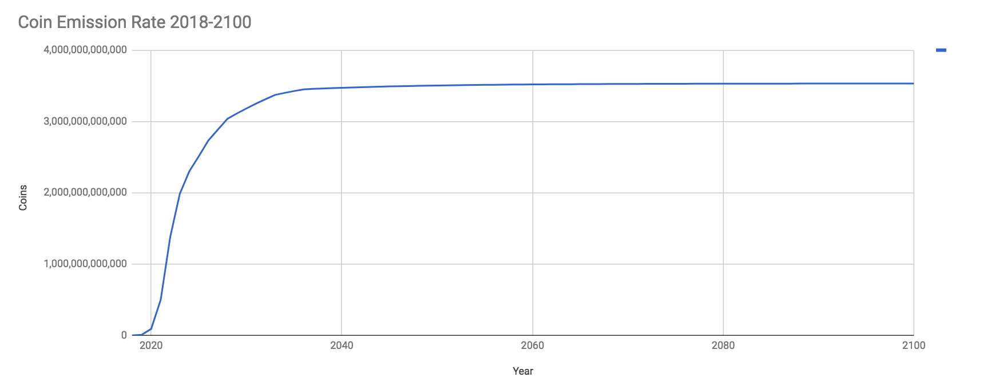

# The PAN Litepaper: Crypto for All Humanity

## Table of Contents

- [The PAN Litepaper: Crypto for All Humanity](#the-pan-litepaper:-crypto-for-all-humanity)
	- [Introduction](#introduction)
	- [Vision](#vision)
	- [Execution Plan](#execution-plan)
		- [Economics](#economics)
			- [Initial Coin Distribution (ICD)](#initial-coin-distribution-(icd))
			- [Block Rewards](#block-rewards)
			- [Block Rewards Distribution Table](#block-rewards-distribution-table)
			- [Coin Emission Rate](#coin-emission-rate)
		- [Product](#product)
	- [What Makes Pan Different](#what-makes-pan-different)
	- [Conclusion](#conclusion)
	- [What's Next](#what's-next)

## Introduction

We live in a world of technological marvel and economic growth, where our basic human needs are taken care of so that we can realize our inherent and individual intellectual, artistic and social potential as human beings. But that vision is reality for only twenty percent of humanity.

Eighty percent of the human population lives on less than $10 per day. About half of the global poor live on $2.50 per day and a little less than half of them live in extreme poverty, on just $1.25 per day. These people are starved for capital, their lives spent in a constant, precarious and primitive search for their next meal. As a result, the global poor do not receive adequate education, nutrition, clean water or healthcare. As many as 22,000 children die every day because of poverty.

The global poor represent both a threat to the vision of global economic growth — because it’s not working for them — and its greatest potential engine. Humanity can not continue with only some of its number having access to prosperity. Either we must all have access to the promise of prosperity, or prosperity itself with stumble, falter and transmute into something else.

Wealth perpetuates itself through interest and return on investment, growing ever greater over time. But the poor trade their bodies and time for inflationary government-manipulated fiat currency that declines in value over time. Any surplus wealth they create can not be effectively saved in fiat currency because governments are constantly inflating it away, some more than others.

Thus we see, for example, the phenomenon of unfinished, un-lived-in houses in Kenya, where the best savings plan available is to buy concrete and build a new house. Or to have more and more children, a human savings plan that is smart for the individual parent but long-term only perpetuates the cycle of poverty and reduces quality of life for the many.

Basic income experiments have shown that, when given extra capital, the global poor will use it to improve their lives, through investment and spending on necessities such as food and education.

We believe that every human being can realize their innate potential. We believe that every human being can be not just a self-sustaining economic unit, but also one that adds value to every other human economic unit on the planet through the institution of the free market, without a central authority to manipulate it.

We believe that what is lacking to realize this vision is capital, and not the expensive and dependency-forming government welfare that is the universal basic income.

We believe that the current world is one where governments too frequently pick winners and losers, where government, a rent-seeking middleman itself, effectively cultivates other rent-seeking middlemen to prey on the poor and prosper to the disadvantage of the poor, especially in the areas of government, banking, insurance, dispute resolution, property registration and currency.

We will create a blockchain-based global ledger system to replace the corrupted government-middleman order and the fragmented informal economy.

We will stake every human being over the age of majority into this system with an initial coin distribution (ICD). Every human being will have an incentive to become a part of the network and to start transacting in it. Every human being immediately is included in this system and has a stake in it. Existence is your buy-in. Prior to the receipt of the airdrop, participants will have to complete a self-serve, video-based, mobile-first educational program in order to ensure they are prepared to use their new capital safely.

Humans will be able to exchange coins instantaneously and for low fees using only a cellphone. There will be incentives for merchant adoption. 

We have the vision. We will expand our vision by working with experts on poverty, economics, cryptocurrency, politics, economic development and more.

We will get funding in a method to be determined and onboard tech, marketing and support teams. We will take the best tech currently available in the cryptocurrency space and marry it to a savvy marketing program in order to gain massive adoption: 1 billion verified humans within 5 years.

We will perform initial testing of a proof of concept in the Latin American Spanish-speaking developing world, likely Mexico, Argentina or Colombia, simultaneously with the Philippines (in English). With proper funding, we can add a third testing region, the 540 million Hindi speakers of Northern India.

Once we are near to having a working initial system, we will recruit and incentivize a network of community organizers using digital marketing who will catalyze the use of the currency in their local communities, simultaneously across the globe in a massively parallel process with the help of translators and community leaders. The process will decentralize and take shape under the direction of the community leaders with the founding team just providing support.

We may add a smart contract layer to the blockchain with the intention of enabling humans to register assets so as to make them liquid (for mortgages) and tradeable. Our goal is to enable the poor to cut out rent-seeking middlemen from their lives, so they can have services like banking, insurance, dispute resolution, contract validation, social networking, currency exchange, governance, financial instruments, wills, medical records, and more without having to rely on rent-seeking middlemen.

We will spark a global economic miracle like that of post-WWII Japan, Taiwan, South Korea or Singapore. We will become the tip of the adoption spear for the cryptocurrency ecosystem, bringing it to the largest marketplace ever: the global extralegal economy.

We are starting a conversation around this topic with the intention of seeking investment to make the project happen.

Much work remains to be done to clarify and implement the Pan vision. If you like our principles, plan and/or vision, then [join us](http://pan.money/join/). Together, we will create a borderless, trustless global digital cash system for all humanity. Together, we will solve poverty and bring equitable power to those who are today excluded from the global financial system.

## Vision

We envision a world where the global extralegal economy, with its 5 billion participants, becomes the global blockchain economy and lets loose a torrent of economic growth that will materially resolve persistent problems like poverty, malnutrition, early death, sex trafficking, slavery and more.

We envision a world in which individuals are in control of the product of their labor and can securely save and invest it to improve their lives, as they see fit, in a freed global marketplace without interference from rent-seeking middlemen such as governments and government-protected corporations.

We envision a world in which every human being has an immediate financial stake in the economic system, and can immediately have in a liquid form their human capability and economic potential, so that they can add to the global culture.

We envision a world in which every human being that reaches the age of majority, forever, begins their adult life with a birthright capital airdrop in the form of Pan coins. No longer must some humans scrape by in poverty forever because their parents were also poor. No longer must some humans predicate their education on the belief that they must find employment at the age of majority. They can guide their educational program towards the exploration of their passions, the realization of their innate talents, and upon the age of majority have the capital required to start a business, pursue advanced education or do whatever they like. Every child is now born with a trust fund. 

We envision a world with 1 billion new Pan cryptocurrency users within 5 years of the launch of Pan, where these users actively participate in a wide range of cryptocurrency projects, where cryptocurrency adoption is no longer a subject for concern but a reality, where we are experiencing a doubling of developing world GDP within 10 years of the launch of Pan, and have effectively eradicated poverty within 25 years.

We envision a world of fairness, transparency and property, where middlemen no longer block anyone’s path to the global economy, where all are included, by default, where humanity can flourish and reach for new heights in science, philosophy, economics, industry, music, health, education and much more.

We envision a world in which the crypto economy is solving all the problems governments and other middlemen have not solved, and where the cryptocurrency ecosystem enjoys unprecedented respect as a result.

We envision a world with Pan cryptocurrency for all.

## Execution Plan

Pan’s goal is to bring 1 billion new people, mostly from among the global poor, into the cryptocurrency ecosystem within the first 5 years of its launch, using a trustless digital cash system whose design is based on market research in the developing world via a roughly equal starting stake for every participant, merchant adoption incentives, a self-serve business and cryptocurrency skills training program, localized viral marketing, a success-oriented social network and a staged rollout; and by doing so double the GDP growth rate across the developing world within 10 years and effectively eradicate poverty within 25 years. Once the digital cash system is working, we may also add smart contract functionality in order to facilitate asset registry and related features within the Pan system.

Pan is building a prosperity network, with multiple network effects, a marketing strategy that leverages incentives and user attachment, significant protection from Sybil attacks, a Pan organization, and an evolving project roadmap. We’re opening doors for other worthy crypto projects by serving as a gateway coin and ensuring that global crypto currency regulation is more like the Japanese model and less like the BitLicense.

This is an early draft execution plan, it is not written in stone by any means and we are looking for co-founders, core team members, advisors and allies to help shape the Pan plan.

### Economics

The economics of Pan revolve around the initial coin distribution (ICD). The ICD is the amount of Pan cryptocurrency that is airdropped to each human being who joins the Pan system. The ICD amount (number of Pan coins per ICD) declines over time. The total amount of coins emitted starts modestly, increases rapidly after 2020 and the growth curve peaks in the late 2030s.

There is no hard limit to the number of Pan coins, as the number continues to grow indefinitely, but the coin supply is expected to top out around 3.5 trillion Pan coins. The growth rate after 2040 will constitute only the negligible amount required to keep up with the modest number of humans reaching the age of majority each year after that and the minimal amount of coins included in the ICD by then.

A 3.5 trillion coin supply sounds a lot. It is. But it’s important to keep in mind the following: 
- The total amount of money in the world in the form of bank notes, coins and savings and checking accounts balances is approximately USD$36.8 trillion.
-  “Broad money,” which includes the above plus easily accesible money is approximately USD$90.4 trillion.
-  Total word debt is approximately USD$215 trillion

So, for a cryptocurrency that is staking every human being into it, a coin supply of 3.5 trillion is reasonable, and perhaps even conservative.

#### Initial Coin Distribution (ICD)

The initial ICD amount is 1,000 Pan coins for 2018 and 2019 but then declines by 10% per year from 2020 to 2040, inclusive. The rate of decline slows to 5% from 2041 onwards. Thus, while the ICD amount (the number of airdropped coins given to new users) is 1,000 Pan coins in 2018 and 2019, by 2020 that number falls to 900. By 2025 it is 531.44. By 2040, it is 109.42. This serves as an incentive to participants to claim their Pan early. It also takes into account the expected rise in real-world purchasing power of Pan over this period of time, to ensure the early adopters are rewarded and late adopters still receive an ICD with meaningful real-world purchasing power.

By 2100, approximately 77.65% of all currently emitted Pan coins will have been made available for distribution to Pan participants through initial coin distributions. The Pan treasury shall have received 4.52% of all Pan coins emitted to date, and miners and masternodes shall have each collectively received 8.91%. Pan is committed to ensuring that the great majority of its coins is reserved for participants and believes these distribution percentages will be sufficient to ensure network consensus, security, development and marketing.

#### Block Rewards

Pan is expected to be a hybrid proof-of-work and proof-of-stake blockchain, similar to Dash, with masternodes. Pan is a decentralized autonomous organization (DAO). Block rewards primarily go towards fulfilling ICDs (and are built around expected ICD demand), but shares are also apportioned to miners, masternodes and a Pan treasury (which functions like the Dash treasury). The purpose of the Pan treasury is for masternodes to vote on funding proposals that will develop and grow the Pan system, to pay for development, marketing, incentives, advisors, the team, community, etc. In this way, Pan is self-funding.

During the high growth period of 2018-2023, the block reward distribution is geared towards establishing the network: Pan development and marketing, miners and masternodes. During the stability period of 2023 onwards, coin emission declines and block rewards remain focused principally on ICDs. It is expected that during the stability period of 2023 onwards, when block rewards will be greatly reduced in absolute number, that a healthy fee market for transactions will emerge and that the purchasing power of Pan coins in the marketplace will have increased substantially.

#### Block Rewards Distribution Table

#### Coin Emission Rate

Pan is engineered to distribute up to approximately 1 billion ICDs within the first 5 years, with a growth rate of ICDs of 1,000% in 2019 and 2020, 500% in 2021 and 200% in 2022. The growth rate declines after that to 75% in 2023, 25% in 2024, and rapidly declines to single digits or less after that with a slowly declining coin emission rate that mimics the human growth rate but seeks to remain under it in order to stimulate demand and incentivize people to claim their ICDs promptly.

View the full Pan projections at [http://pan.money/PanProjections](http://pan.money/PanProjections). Feel free to make a copy of the file at that URL and change the assumptions or even start over from scratch to design a better Pan economic system. We not only welcome your input, we are seeking co-founders and advisors to give shape to the economics and all other aspects of Pan, as the above is just the initial, very broad strokes, and we would like to make coin emission contingent on claims as well as other productive user actions, perhaps via smart contract or some other mechanism to be determined.

### Product

The Pan product is a prosperity network for the 80% of humanity that lives on less than $10 per day. Pan starts with an initial coin distribution (ICD), or airdrop of Pan cryptocurrency, that is the initial growth lever. It includes solutions for identity and convenient digital cash. Pan provides a self-serve Crypto University program where participants will learn about cryptocurrency usage and security, business skills, mindset and other skills necessary to achieve business success. 

Pan is also an Instagram-like social network with the message “See me grow,” where Pan participants can inspire and be inspired by showing off their progress towards their business and wealth goals as they prosper by using not just the Pan system, but also the greater cryptocurrency ecosystem that they now have easy access to.

Pan is a gateway cryptocurrency that stakes every member of humanity into the cryptocurrency ecosystem. We’re giving the global poor a reason to care about cryptocurrency. Pan is making cryptocurrency, not a first-world Silicon-Valley-style experiment for the global wealthy, but an effective tool for value storage, transmission and creation for literally everyone — forever. Pan is a new, human birthright because Pan continues emitting small amounts of coins indefinitely post-2040 in order to roughly keep up with the expected growth of humanity.

Pan is inherently a global entrepreneurship development program, with Pan gifted as an incentive for joining, for completing educational modules, for bringing new people into your own Pan network, and for investing and transacting, and for using the Pan Instagram clone, where you show off your entrepreneurial progress.

Pan is:
-  education;
- money (capital);
- tools to ease transactions across arbitrary nation-state limits;
- tools for building a professional network;
- tools for investing;
- a gateway to the wider world of cryptocurrency, with all of its tools for doing business as well as its experts; and
- a package of incentives to build new businesses.

The Pan product is how the cryptocurrency ecosystem both sparks an economic growth miracle among the 5 billion members of the global poor, and also how we grow cryptocurrency adoption to ensure that crypto flourishes, and does not stagnate.

## What Makes Pan Different

We believe the following characteristics make the Pan project unique in the cryptocurrency space.
-	Pan’s target market is the 5-billion-member global informal economy. No other project aims to airdrop crypto capital to every member of this excluded group, but they are the ones who most need it. The global poor are a highly entrepreneurial and proactive group, which makes them well-suited for the informal and extra-state nature of cryptocurrencies.
-	Pan promises roughly equal initial staking for every human forever. Pan is for everyone, everywhere. It’s a new human birthright.
-	Pan includes an incentive for the entire world to use Pan cryptocurrency from day 1 — because every person has a roughly equal amount, and no one is excluded.
-	Pan includes an incentive to bring your existing network of people into the Pan system, because the more web-of-trust-style verifications you receive, the greater a percentage of your initial coin distribution you can unlock.
-	Pan uses psychology to incentivize use of the app and currency. Pan is targeting entrepreneurs first, with tools not just to help them grow businesses and connect with collaborators, but also to show off their growth, Instagram-style, to their networks, in order to simultaneously increase their real-world reputations and promote Pan.
-	Pan includes a training program to bring new users up to speed, in their own language, on topics such as cryptocurrency security, business skills and more.
-	Pan includes an entrepreneurship development program that aims not just to get the global poor buying sewing machines or raw materials for ceramic vases, but to enable them to build their own medium- and large-scale enterprises in order to maximize worker productivity and grow developing world economies in meaningful ways.
-	Pan includes incentives for merchant adoption and will actively woo merchants before releasing the initial coin distributions. Pan will be useful from day 1.
-	Pan is big-picture thinking that aims to conclusively make the case for cryptocurrency by sparking a global economic “miracle” like the one in East Asia in the latter half of the twentieth century.
-	Pan is putting people first and technology second. We will build the technology to suit the people.
-	Pan includes a massively parallel viral growth program focused on adoption across developing world cultures that incentivizes participants to make real-world, person-to-person connections.
-	Pan doesn’t seek government acceptance, and isn’t dependent on it. Pan is building an alternative to nation-state corruption.
-	The overwhelming majority of the Pan coin supply — as much as 80% — is reserved for airdrops.
-	Pan aims to solve the adoption problem for the cryptocurrency space.
-	Pan aims to be the last mile of the cryptocurrency world and, as such, when successful, will add a huge amount of value to the crypto ecosystem.
-	Pan aims to alter the balance of power between governments and the crypto space in the latter’s favor in order to ensure that global cryptocurrency regulation is favorable, and not a limiting factor for the future of the space.

Pan is crypto for all. It’s a new human birthright that aims to solve global poverty not through dependence-forming charity or burdensome credit but by bringing opportunities for growth, tools, training and psychological support to entrepreneurs. With a viral transmission component, merchant incentives and as much as 80% of the Pan coin supply reserved for airdrops, Pan aims to solve the cryptocurrency adoption challenge and definitively alter the balance of power between governments and the crypto economy — in our favor.

## Conclusion

Pan will build a prosperity network to spread the use of cryptocurrency across the globe and spark an economic growth miracle for the 5 billion members of humanity who currently live on less than $10 per day, opening doors for other worthy crypto projects as a gateway coin and ensuring that global cryptocurrency regulation is more like the Japanese model and less like the BitLicense.

[Join us.](http://pan.money/join/)

## What's Next

We’re seeking thinkers, writers, translators, developers, co-founders, core team members, partners, investors, donors, investors, evangelists, marketers, community managers, users and more. Here are some ways you can start being a part of the Pan project.

* [Join this mailing list](http://pan.money/join/) to be the first to receive updates on the development of Pan as well as opportunities for participation in the Pan ecosystem.
* Give your feedback on this document at [http://pan.money/manifesto](http://pan.money/manifesto).
* Share the Pan Manifesto with other interested individuals.
* Talk about Pan at our [Discord server](https://discord.gg/knS2kJp) and our [Telegram group](http://t.me/PanMoney). We need your ideas.
* Follow us on Twitter at [@PanMoney1](http://twitter.com/PanMoney1).
* Email the author directly at me@georgedonnelly.com.